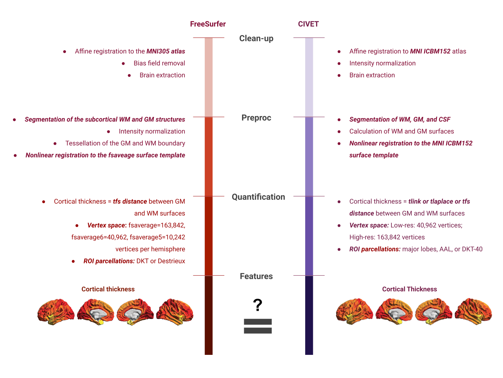
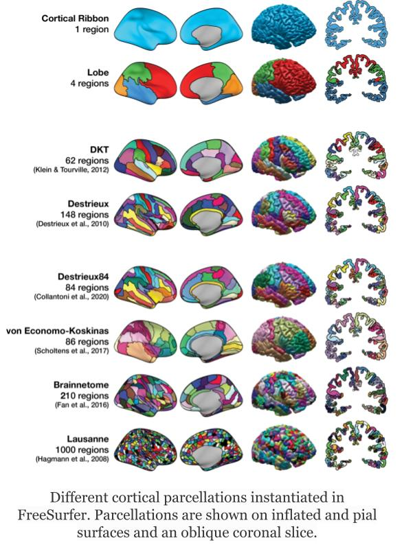

::::::::::::::::::::::::::::::::::::::: objectives

- Understand impact of software and atlas choices

::::::::::::::::::::::::::::::::::::::::::::::::::

:::::::::::::::::::::::::::::::::::::::: questions

- How sensitive are the findings to your MR pipeline parameters?

::::::::::::::::::::::::::::::::::::::::::::::::::

## You Are Here!

{alt='course\_flow'}

## MR image processing pipeline selection choices

- Compute environment

  - OS / system math libraries
  - Programming libraries Python / R versions

- Software (algorithms and their versions)

  - Image clean-up
  - Image normalization
  - Image quantification

- Quality control

  - Manual protocol specifics
  - Automatic outlier criteria

- Biological priors

  - Templates
  - Atlases/parcellations: ROI definitions

## Example software analysis

### Task: compare cortical thickness between FreeSurfer and CIVET

*Note: See [this article]([https://academic.oup.com/cercor/article/30/9/5014/5831485]) for details on brain plots*

## Correlation between thickness measurements:

### Software: FreeSurfer (v5.1, v5.3, v6.0), CIVET (2.1) and ANTs

### Parcellation: DKT

## Possible choices for FreeSurfer parcellations

### Different parcellation different results?

### Inference pertaining to neuroantomical differences and/or prediction models based on individual neuroanatomical feature sets can be sensitive to parcellation choice.

*Note: Image adopted from [Madan 2021](https://link.springer.com/article/10.1007/s12021-021-09519-6)*

:::::::::::::::::::::::::::::::::::::::: keypoints

- It is crucial to assess biological vs methodological variation in your findings to avoid reproducibility crisis.

::::::::::::::::::::::::::::::::::::::::::::::::::

