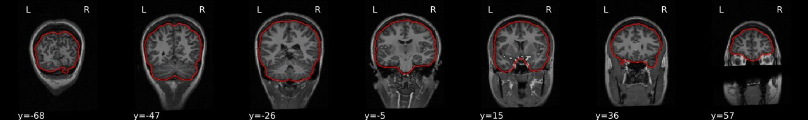

## You Are Here!

## Image Clean-ups
### Intensity normalization (a.k.a bias field correction; a.k.a. intensity inhomogeneity correction)

- The bias field is a low-frequency spatially varying MRI artifact resulting from spatial inhomogeneity of the magnetic field,
variations in the sensitivity of the reception coil, and the interaction between the magnetic field and the human body. 
- It causes a smooth signal intensity variation within tissue of the same physical properties. 
- The bias field is dependent on the strength of the magnetic field. If it is not corrected for 1.5T or higher MR scanners, it can considerably affect downstram analyses. 
- Commonly used tools
    - [ANTs N4 bias correction](https://pubmed.ncbi.nlm.nih.gov/20378467/) (See figure below)
    - [FSL FAST](https://fsl.fmrib.ox.ac.uk/fsl/fslwiki/FAST) (_Note:FSL FAST is a multi-purpose segmentation tool that includes the bias field correction._)

- ANTs N4 correction
- 

- Impact of correction (_source: [Despotović et al.](https://www.hindawi.com/journals/cmmm/2015/450341/)_)
- 

### Brain extraction (a.k.a skull-stripping)
- Image contrasts from nonbrain tissues such as fat, skull, or neck can cause issues with downstream analyses starting with brain tissue segmentation.
- The brain extraction generates a mask that identifies brain voxels comprising grey-matter (GM), white-matter(WM), and Cerebrospinal fluid (CSF) of
the cerebral cortex and subcortical structures, including the brain stem and cerebellum. 
- The scalp, dura matter, fat, skin, muscles, eyes, and bones are classified as nonbrain voxels.

- Commonly used tools
    - [antsBrainExtraction](https://nipype.readthedocs.io/en/latest/api/generated/nipype.interfaces.ants.html#brainextraction)
    - [FSL brain extraction tool (BET)](https://fsl.fmrib.ox.ac.uk/fsl/fslwiki/BET)

- ANTs Brain Extraction
- 

- FSL BET 
- 



