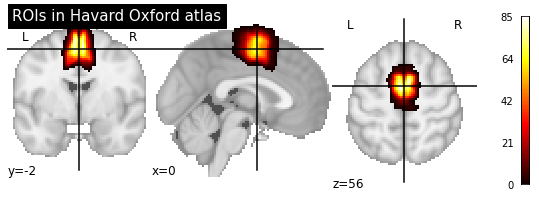
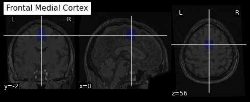
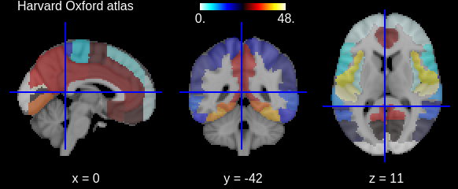
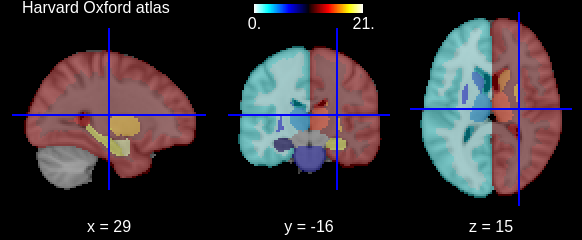

## You Are Here!
Course flow image edited for this episode to be placed here.

**Assumptions:**
* the source of contrast in T1, T2, PD has been explained in another episode in terms of GM, WM , CSF. If possible, also include FLAIR.
**Data:**

Brain anatomy is different for every individual. Brain tissues are typically divided into grey matter (GM), white matter (WM) and cerebro-spinal fluid (CSF) classes. Each class can inform on a different aspect of the brain studied. Therefore it is often useful to segment the brain in these tissue components for further processing. GM contains neuron cell bodies, WM includes neuron connection fibers wrapped in a special signal-accelerating substance called myelin, and CSF is a protecting fluid present mostly around the brain but also within brain cavities called ventricles.

In addition of identifying tissue classes, it is of interest to sub-divide these classes in sub-components. As such, GM is commonly split into non-overlapping regions of interests (ROIs) via a parcellation scheme either defined from a data-driven or an anatomically-driven approach. The term atlas and parcellation are often used interchangeably and even together (e.g. the atlas X, the Y parcellation, the atlas parcellation Z). Please note that WM can also be split into group of fibers called white matter bundles (for more details please see lesson on diffusion MRI).

Aging and disease can cause tissue modifications. Common changes include a reduction in GM, as in the  case of ageing and neurodegenerative diseases such as Alzheimer's. A tumor can cause an important localized change of signal in the area most impacted by the tumor. Another example is visibly higher WM signal intensities on MRI images, so called WM hyper-intensities, which can be related to vascular pathology (common in aging), or to myelin lesions characteristic of the multiple sclerosis disease.

*This image is Copyright © My-MS.org and falls under Image License D defined under the Image License section of the My-MS.org Disclaimer page.*

The analysis of structural images then often consists in first identifying tissue classes -- including pathological tissue -- and their sub-components, and second quantifying morphological differences. The first step is done by segmenting the MRI images, and the second one by measuring differences in signal intensity across subjects (with techniques such as voxel based morphometry (VBM)) or in morphological properties such as volume or thickness. GM loss for example can be assessed by:
* measuring GM volume when looking at volumetric data, i.e. voxels
* measuring GM thickness when looking at surface data, i.e. meshes
* comparing the intensity on MRI images with a group of normal control with patients suffering from GM
The resulting measures can also be used as features for machine learning approaches.

Common software to segment volumetric data include [FSL](https://fsl.fmrib.ox.ac.uk/fsl/fslwiki), [SPM](http://www.fil.ion.ucl.ac.uk/spm) and [ANTS](http://stnava.github.io/ANTs). One of the mostly used software to segment surface data (in addition of volumetric data) is [Freesurfer](http://surfer.nmr.mgh.harvard.edu).

In this episode we will look at:
* how to segment images into tissue classes, and also also sub-regions in the case of GM
* how to visualize segmentation results both for volumetric and surface data
* how to measure region volumes
* how to extract surface measures pre-computed from a third party software (Freesurfer)

## Segmenting and visualizing brain tissues

The tissues can be differentiated according to the MRI signal intensity, however as seen in episode X, the main magnetic field can introduce bias and create signal inhomogeneities. It is therefore important to implement bias field correction before carrying out segmentation according to tissue intensities.

Usually the T1 MRI modality is used for segmentation as it offers the best contrast between GM, WM and CSF. However combining multiple modalities (such as T2, PD and FLAIR) can help improving the segmentation, especially in the presence of lesions.

Tissue segmentation is presented first for normal controls. Then differences are shown for patients having Alzheimer's or the multiple sclerosis disease.

### In normal controls

In normal controls, the number of tissue classes is usually fixed. A distribution of the intensity of the different tissue types can be obtained by loading T1 volumes with `nibabel` then plotting a slice with `matplotlib` and displaying an histogram with `seaborn` (a plotting library built on top of `matplotlib`).

~~~
import matplotlib.pyplot as plt
import seaborn as sns
~~~
{: .language-python}

~~~
plt.imshow(t1_brain_data[:, :, 140], origin="lower")
plt.colorbar();
~~~
{: .language-python}

~~~
# Compute the optimal bin size according to the data
bins = np.histogram_bin_edges(t1_brain_data[t1_brain_data != 0], bins='auto')
# Plot the histogram
sns.histplot(t1_brain_data[t1_brain_data != 0], bins=bins)
~~~
{: .language-python}

We can see here three main components corresponding to GM, WM and CSF.

Usually segmentation on intensity alone is not optimal, and a template with a tissue probability map (probability of presence of a given tissue at a given location) is also used.

The output of segmentation algorithm are also usually probability map for each tissue class. To transform the probability map into a binary mask, the map needs to be thresholded.

> ## Probability map threshold 1
>
> What do we mean by a probability threshold of X % ?
>
> > ## Solution
> >
> > The probability threshold is the threshold under which all voxels below this threshold will be set to 0, and all voxels above will be set to 1 in the resulting binary mask. A treshold is between 0 and 100 %, or equivalently between 0 or 1.
> {: .solution}
{: .challenge}

> ## Probability map threshold 2
>
> What do you think is a typical trheshold to transform tissue probability map into a binary mask ?
>
> > ## Solution
> >
> > A typical threshold is 50%. You can increase it to avoid false negative, but a threshold below 50% could cause some probability maps to overlap.
> {: .solution}
{: .challenge}

We can visualize the segmentation by loading adding an overlay representing the different tissue classes after segmentation. For this, we use the `nilearn` library. By extracting the signal intensity from each of the binary mask we can see that the intensity itself is not enough to differentiate the different tissue, and additional information, such as the voxels localizations, should also be used.

~~~
from nilearn import plotting
plotting.plot_roi(roi_img=t1_seg, bg_img=t1, alpha=0.4, cmap="Set3");
~~~
{: .language-python}

~~~
import itertools
labels = np.unique(t1_seg_data[t1_seg_data != 0]).astype('int')
palette = itertools.cycle(sns.color_palette("Set3"))
for label in labels:
    sns.histplot(t1_brain_data[t1_seg_data == label], bins=bins, color=next(palette), alpha=0.6)
~~~
{: .language-python}

The segmentation into GM and WM voxels allows to identify surfaces surrounding these tissues. Some software such as Freesurfer can use this information to identify the most external surface of the brain, the GM pial surface, and the WM surface below. The images below show the delineation of GM (in read) and WM (in blue) before (left) and after (right) discarding deep GM structures such as the basal ganglia.

The segmentation of surface data provides 3D meshes separating WM from GM. Such meshes are typically obtained with `Freesurfer` and can also be plotted with `nilearn`.

~~~
# The pial surface is the most external surface of the GM
pial_surf = nib.load(pial_surf_file)
pial_verts, pial_faces = pial_surf.agg_data(('pointset', 'triangle'))
plotting.plot_surf((pial_verts, pial_faces))
~~~
{: .language-python}

~~~
# The WM surface is between GM and WM
wm_surf = nib.load(wm_surf_file)
wm_verts, wm_faces = wm_surf.agg_data(('pointset', 'triangle'))
# 
plotting.plot_surf((wm_verts, wm_faces))
~~~
{: .language-python}

### In disease such as Alzheimer's and multiple sclerosis

The brain GM volume tends to shrink with age, with the GM loss typically replaced with CSF. This process is called atrophy. In Alzheimer's disease and other neuro-degenerative disease, atrophy is amplified (the "degeneration" is the loss of GM). Therefore special care is required when processing data of patients whose disease can cause in the brain morphology.

Below is a T1 image of an Alzheimer's disease patient. An enlargement of the CSV containing cavities, the ventricles, can be seen.

Below is a T1 and FLAIR image of an MS patient. The lesion enhancing FLAIR modality clearly show lesions. These lesions can sometimes be seen on the T1 image. In this case they appear as dark spots called "black holes".

> ## Segmentation problems in disease
>
> What problems do you expect in the segmentation pipeline when analyzing Alzheimer's or multiple sclerosis data ?
>
> > ## Solution
> >
> > The registration to a template can be problematic in Alzheimer's disease when the morphology of the brain significantly changed due to atrophy. While registration can be successful without additional step, a custom template could also be used to mitigate any potential issues.
> >
> > Registration can also be a problem with multiple sclerosis. Filling the lesions with intensity corresponding to WM is a solution sometimes used to avoid these issues. Some software such as ANTS directly accepts a binary lesion mask as an input to deal with this kind of data.
> {: .solution}
{: .challenge}

## Segmenting tissue classes into sub-components: atlasing, parcellation

### Atlas and parcellation

A brain atlas is often considered as a set of labelled regions defined on a template. A parcellation can be defined as the splitting of an object into non-overlapping components. A brain parcellation is then a set of regions making up the whole brain, and is therefore synonymous with "atlas".

While an atlas is often expected to be correspond to an entire brain, this is not so for a parcellation. A parcellation can be limited to a specific region, e.g. the parcellation of the thalamus. It can be also applied to a larger area, such as the cortical GM parcellation for the cortex (the outer layer of the brain) or subcortical GM parcellation, for deep GM (GM structures below cortical GM).  

The picture can be muddled when considering probabilistic atlases. In this case each region is associated to a probabilistic map: each voxel has a given probability to belong to the region considered. Since a voxel has now a different probability to belong to each atlas ROI, ROI probability maps overlap. A "true" parcellation can then be obtained by associating to each voxel the label with the maximum probability.

> ## Probability atlas threshold
>
> Given a probabilistic atlas, is there a single probability threshold which would guaranteed each brain voxel to have a unique label ?
>
> > ## Solution
> >
> > In virtually all cases no single threshold will result in each voxel to belong to a unique ROI. A high threshold will result in voxels not having a label, while a low threshold will cause voxels to belong to overlapping probability maps. It is very unlikely for a single threshold to provide a true parcellation. 
> {: .solution}
{: .challenge}

While atlases were originally defined so that each region had a text label anatomically meaningful (e.g. "visual cortex"), it is now common to use purely data-driven atlases. While each region of these atlases are still considered homogeneous according to some neuroimaging properties, they do not have a text label associated to their ROIs.

Note that atlases often refer to a given tissue type, such as WM, and can be considered as further segmentation of the set of voxels corresponding to that tissue. It is often implied that an atlas corresponds to GM parcellation, and while atlas of WM also exist, we will focus in this lesson on GM atlases. 

### Visualizing atlases and parcellation

#### Non probabilistic volumetric atlas

An example of "true" parcellation atlas, motivated by neuroanatomy, is the Automated Anatomical Labeling (AAL) atlas. Each voxel belongs to an ROI, and only one. Each ROI has an anatomically meaningful text label. The atlas is aligned with the MNI MRI single-subject brain .  It is represented as a 3D volume in which each voxel has for intensity the integer labelling the ROI it correspond to, e.g. 2401 for the the left hemisphere supplementary motor area.

`Nilearn` offers a collection of atlases in its `datasets` module. The AAL atlas, text labels and integer indices can all be obtained through this module.
~~~
from nilearn.datasets import fetch_atlas_aal
AAL_dataset = fetch_atlas_aal()
AAL_maps = AAL_dataset.maps
AAL_labels = AAL_dataset['labels']
AAL_labels_ix = AAL_dataset['indices']
~~~
{: .language-python}

To get a given ROI integer label, there are two possibilities:
1. The ROI integer label is simply the index of its text label in the list, e.g. if "visual cortex" is in position 3 in AAL_dataset['labels'] the corresponding integer label in the image is 3
2. The ROI integer label does not correspond to the text label index. In this case `nilearn` provide a list of indices, e.g. if "visual cortex" is in position 3 in AAL_dataset['labels'], then the corresponding integer label is found at position 3 in AAL_dataset['indices']

We can check the atlas dimension by loading it with `nibabel`
~~~
AAL_img = nib.load(AAL_maps)
AAL_img.shape
~~~
{: .language-python}

~~~
(91, 109, 91)
~~~
{: .output}

We can use the same `plot_roi` function of the `nilearn` `plotting` module as before:
~~~
plotting.plot_roi(roi_img=AAL_maps, bg_img=t1_mni, alpha=0.4,
                  title="AAL atlas");
~~~
{: .language-python}

We can extract a specific ROI in two steps:
1. Identify the integer index corresponding to the ROI
2. Get all the voxels corresponding to that index

For the AAL atlas, the ROI integer labels are not in the order of the text labels so we implement the following code:

~~~
roi_label = "Supp_Motor_Area_L"
roi_label_pos = AAL_labels.index(roi_label)
roi_ix = int(AAL_labels_ix[roi_label_pos])
print(roi_ix)
~~~
{: .language-python}
~~~
2401
~~~
{: .output}

Now we extract the `numpy` array in which the atlas is encoded with the `get_fdata` method, and we create a boolean array with `True` if the voxel label is equal to our ROI index, and `False` if not.

~~~
roi_mask_arr = (AAL_img.get_fdata() == roi_ix)
~~~
{: .language-python}

We then convert the boolean array to integer values, and create an Image object by indicating the original image properties (the affine transformation)
~~~
roi_mask_int = nib.Nifti1Image(roi_mask_arr.astype(int), 
                               affine=AAL_img.affine)
~~~
{: .language-python}

Here is the result when plotting it with `nilearn`
~~~
plotting.plot_roi(roi_img=roi_mask_int, bg_img=t1_mni, 
                  alpha=0.4, title=roi_label);
~~~
{: .language-python}

#### Probabilistic volumetric atlas

An example of probabilistic atlas is the Harvard Oxford atlas. Each ROI of the atlas is a probability map. As a result this atlas can be represented as a 4D volume with the fourth dimension indexing all atlas ROIs.

The Harvard Oxford atlas is also available in `nilearn` in two sets, one for the cortical area and another one for the subcortical area. Since the ROI indices match the order of the text labels (0, 1, ...) no explicit indices are provided.

~~~
from nilearn.datasets import fetch_atlas_harvard_oxford
harvard_oxford = fetch_atlas_harvard_oxford('cort-prob-2mm')
harvard_oxford_maps = harvard_oxford['maps']
harvard_oxford_labels = harvard_oxford['labels']
~~~
{: .language-python}

We can again check the atlas dimension with `nibabel`
~~~
harvard_oxford_img = nib.load(harvard_oxford_maps)
harvard_oxford_img.shape
~~~
{: .language-python}

~~~
(91, 109, 91, 48)
~~~
{: .output}

The procedure to extract a specific ROI is similar:
1. Identify the integer index corresponding to the ROI
2. Get the volume in the 4D array corresponding to that index

The second step is facilitated by the convenience function `index_img` of the `nilearn` `image` module:

~~~
from nilearn import image
roi_label = "Frontal Medial Cortex"
roi_ix = int(harvard_oxford_labels.index(roi_label))
roi_prob_mask = image.index_img(harvard_oxford_maps, roi_ix)
~~~

We can display the probability mask with the `plot_stat_map` function of the `nilearn` `plotting` module:
~~~
plotting.plot_stat_map(roi_prob_mask, 
                       title="ROIs in Havard Oxford atlas");
~~~
{: .language-python}

To create a binary mask, one could copy the underlying array storing the probability map and thresholding it according to some threshold.
~~~
roi_prob_mask_arr = roi_prob_mask.get_fdata()
roi_mask_arr_thr = roi_prob_mask_arr.copy()
thr = 25
roi_mask_arr_thr[roi_mask_arr_thr<thr] = 0
roi_mask_arr_thr[roi_mask_arr_thr>=thr] = 1
~~~
{: .language-python}

To display it, we need to reattach the image geometrical properties into a `nibabel` `Nifti1Image` object.

~~~
roi_mask_thr = nib.Nifti1Image(roi_mask_arr_thr, 
                               affine=roi_prob_mask.affine)
plotting.plot_roi(roi_img=roi_mask_thr, bg_img=t1_mni, 
                  alpha=0.4, title=roi_label);
~~~
{: .language-python}

Note that `nilearn` offers pre-thresholded atlases, for example with a threshold of `25`:

~~~
haox_thresholded = fetch_atlas_harvard_oxford('cort-maxprob-thr25-2mm')
haox_thresholded_maps = haox_thresholded['maps']
plotting.view_img(haox_thresholded_maps, title="Harvard Oxford atlas", 
                  symmetric_cmap=False, opacity=0.4)
~~~
{: .language-python}

As mentioned previously the Harvard Oxford atlas comes in two sets, with the second set for subcortical structures.

~~~
haox_subcortical = fetch_atlas_harvard_oxford('sub-maxprob-thr25-2mm')
haox_subcortical_maps = haox_subcortical['maps']
plotting.view_img(haox_subcortical_maps, title="Harvard Oxford atlas", 
                  symmetric_cmap=False, opacity=0.4)
~~~
{: .language-python}

## Quantifying tissue properties

### Metric from volumetric data: region volumes 

A given MRI sequence is often acquired as a stack of slices. As such the in-plane voxel size (e.g. 0.9 mm x 0.9 mm) is not always equal to the slice thickness (e.g. 1 mm). This is important to keep in mind when measuring region volume. Another reason why one should extract the voxel size is that even if the voxels are isotropic (i.e. they have the same size in any dimension), one acquisition can be made with a given size (e.g. 1mm isotropic) and another acquisition with another size (e.g. 0.9 mm isotropic). 

The voxel size of an image can be obtained from the metadata (i.e. the data annotation). This can be accomplished with `nibabel` as follows:

We examine here an example on how to measure each region of a brain atlas in terms of number of voxels, and how to convert this number into mm3.

### Metric from surface data: cortical thickness (using measurements pre-computed from Freesurfer)

Freesurfer is one of the most commonly used software to carry out segmentation. By default Freesurfer compute a certain number of metrics. These metrics are often used directly rather than computing them from the segmentation data.

Freesurfer segments the brain in terms of both volumes and surfaces. It also relies on two atlases to further segment the GM tissue: the Destrieux and the Desikan-Killiany atlas. To add confusion to the distinction between atlas, segmentation and parcellation, Freesurfer called the division of volumetric data into sub-regions "segmentation", and the division of surface data into sub-regions "parcellation". The associated data are named with the keyword `seg` and `parc` respectively.

*Some more information on the type of data output by Freesurfer*

*An example of extracting quantitative information from the Freesurfer stat file*



