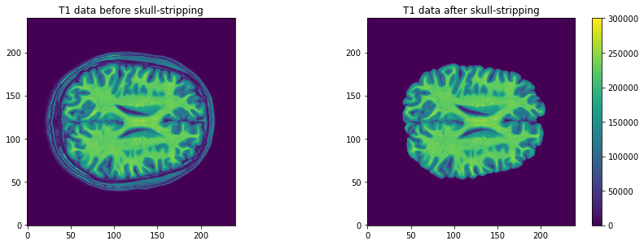
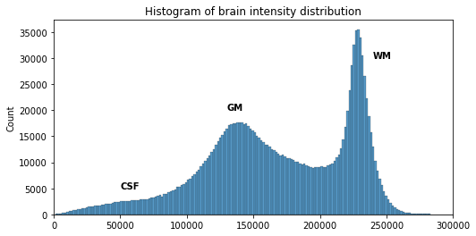

## You Are Here!
Course flow image edited for this episode to be placed here.

**Assumptions:**
* the source of contrast in T1, T2, PD has been explained in another episode in terms of GM, WM , CSF. If possible, also include FLAIR.
**Data:**
0068
0184

## Tissue and region segmentation
Brain anatomy is different for every individual. Brain tissues are typically divided into grey matter (GM), white matter (WM) and cerebro-spinal fluid (CSF) classes. Each class can inform on a different aspect of the brain studied. Therefore it is often useful to segment the brain in these tissue components for further processing. GM contains neuron cell bodies, WM includes neuron connection fibers wrapped in a special signal-accelerating substance called myelin, and CSF is a protecting fluid present mostly around the brain but also within brain cavities called ventricles.

In addition of identifying tissue classes, it is of interest to sub-divide these classes in sub-components. As such, GM is commonly split into non-overlapping regions of interests (ROIs) either defined from either a data-driven or an anatomically-driven approach. These approaches are referred to as parcellation or atlasing respectively, although these terms are sometimes used interchangeably. WM can also be split into group of fibers called white matter bundles (for more details please see lesson on dMRI).

Aging and disease can cause tissue modifications. Common changes include a reduction in GM, as in the  case of ageing and neurodegenerative diseases such as Alzheimer's. A tumor can cause an important localized change of signal in the area most impacted by the tumor. Another example is visibly higher WM signal intensities on MRI images, so called WM hyper-intensities, which can be related to vascular pathology (common in aging), or to myelin lesions characteristic of the multiple sclerosis disease.

The analysis of structural images then often consists in first identifying tissue classes -- including pathological tissue -- and their sub-components, and second quantifying morphological differences. The first step is done by segmenting the MRI images, and the second one by measuring differences in signal intensity across subjects (with techniques such as voxel based morphometry (VBM)) or in morphological properties such as volume or thickness. GM loss for example can be assessed by:
* measuring GM volume when looking at volumetric data, i.e. voxels
* measuring GM thickness when looking at surface data, i.e. meshes
* comparing the intensity on MRI images with a group of normal control with patients suffering from GM
The resulting measures can also be used as features for machine learning approaches.

Common software to segment volumetric data include [FSL](https://fsl.fmrib.ox.ac.uk/fsl/fslwiki), [SPM](http://www.fil.ion.ucl.ac.uk/spm) and [ANTS](http://stnava.github.io/ANTs). One of the mostly used software to segment surface data (in addition of volumetric data) is [Freesurfer](http://surfer.nmr.mgh.harvard.edu).

In this episode we will look at:
* how to segment images into tissue classes, and also also sub-regions in the case of GM
* how to visualize segmentation results both for volumetric and surface data
* how to measure region volumes
* how to extract surface measures pre-computed from a third party software (Freesurfer)

### Segmenting images into tissue classes in normal and pathological tissues, and visualizing the segmentation

The tissues can be differentiated according to the MRI signal intensity, however as seen in episode X, the main magnetic field can introduce bias and create signal inhomogeneities. It is therefore important to implement bias field correction before carrying out segmentation according to tissue intensities.

Usually the T1 MRI modality is used for segmentation as it offers the best contrast between GM, WM and CSF. However combining multiple modalities (such as T2, PD and FLAIR) can help improving the segmentation, especially in the presence of lesions.

Tissue segmentation is presented first for normal controls. Then differences are shown for patients having Alzheimer's or the multiple sclerosis disease.

#### Normal controls

In normal controls, the number of tissue classes is usually fixed. A distribution of the intensity of the different tissue types can be obtained by loading T1 volumes with `nibabel` then plotting a slice with `matplotlib` and displaying an histogram with `seaborn` (a plotting library built on top of `matplotlib`).

~~~
import matplotlib.pyplot as plt
import seaborn as sns
~~~
{: .language-python}

~~~
plt.imshow(t1_brain_data[:, :, 140], origin="lower")
plt.colorbar();
~~~
{: .language-python}

~~~
# Compute the optimal bin size according to the data
bins = np.histogram_bin_edges(t1_brain_data[t1_brain_data != 0], bins='auto')
# Plot the histogram
sns.histplot(t1_brain_data[t1_brain_data != 0], bins=bins)
~~~
{: .language-python}

We can see here three main components corresponding to GM, WM and CSF.

Usually segmentation on intensity alone is not optimal, and a template with a tissue probability map (probability of presence of a given tissue at a given location) is also used.

The output of segmentation algorithm are also usually probability map for each tissue class. To transform the probability map into a binary mask, the map needs to be thresholded.

> ## Probability map threshold 1
>
> What do we mean by a probability threshold of X % ?
>
> > ## Solution
> >
> > The probability threshold is the threshold under which all voxels below this threshold will be set to 0, and all voxels above will be set to 1 in the resulting binary mask. A treshold is between 0 and 100 %, or equivalently between 0 or 1.
> {: .solution}
{: .challenge}

> ## Probability map threshold 2
>
> What do you think is a typical trheshold to transform tissue probability map into a binary mask ?
>
> > ## Solution
> >
> > A typical threshold is 50%. You can increase it to avoid false negative, but a threshold below 50% could cause some probability maps to overlap.
> {: .solution}
{: .challenge}

We can visualize the segmentation by loading adding an overlay representing the different tissue classes after segmentation. For this, we use the `nilearn` library. By extracting the signal intensity from each of the binary mask we can see that the intensity itself is not enough to differentiate the different tissue, and additional information, such as the voxels localizations, should also be used.

~~~
from nilearn import plotting
plotting.plot_roi(roi_img=t1_seg, bg_img=t1, alpha=0.4, cmap="Set3");
~~~
{: .language-python}

~~~
import itertools
labels = np.unique(t1_seg_data[t1_seg_data != 0]).astype('int')
palette = itertools.cycle(sns.color_palette("Set3"))
for label in labels:
    sns.histplot(t1_brain_data[t1_seg_data == label], bins=bins, color=next(palette), alpha=0.6)
~~~
{: .language-python}

The segmentation of surface data provide 3D meshes separating WM from GM. Such meshes are typically obtained with `Freesurfer` and can also be plotted with `nilearn`.

~~~
# The pial surface is the most external surface of the GM
pial_surf = nib.load(pial_surf_file)
pial_verts, pial_faces = pial_surf.agg_data(('pointset', 'triangle'))
plotting.plot_surf((pial_verts, pial_faces))
~~~
{: .language-python}

~~~
# The WM surface is between GM and WM
wm_surf = nib.load(wm_surf_file)
wm_verts, wm_faces = wm_surf.agg_data(('pointset', 'triangle'))
# 
plotting.plot_surf((wm_verts, wm_faces))
~~~
{: .language-python}

#### Disease such as Alzheimer's and multiple sclerosis

The brain GM volume tends to shrink with age, with the GM loss typically replaced with CSF. This process is called atrophy. In Alzheimer's disease and other neuro-degenerative disease, atrophy is amplified (the "degeneration" is the loss of GM). Therefore special care is required when assessing the resulting of the segmentation as the tissue template may lead to errors.

Ex: load and visualize the Alzheimer dataset: what can you say of this patient ?

### Segmenting tissue classes into sub-components (atlasing, parcellation) and visualizing the results

#### Atlasing

#### Parcellation

### Measuring region volumes

#### Revisiting image properties: voxel size and affine transform

#### Measuring volume in standard units

### Extracting surface measurements from pre-computed Freesurfer data

#### Type of information available from Freesurfer

#### Extracting Freesurfer information with Python



