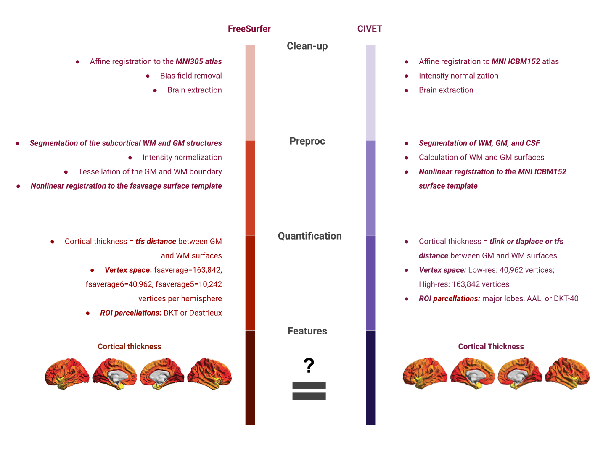
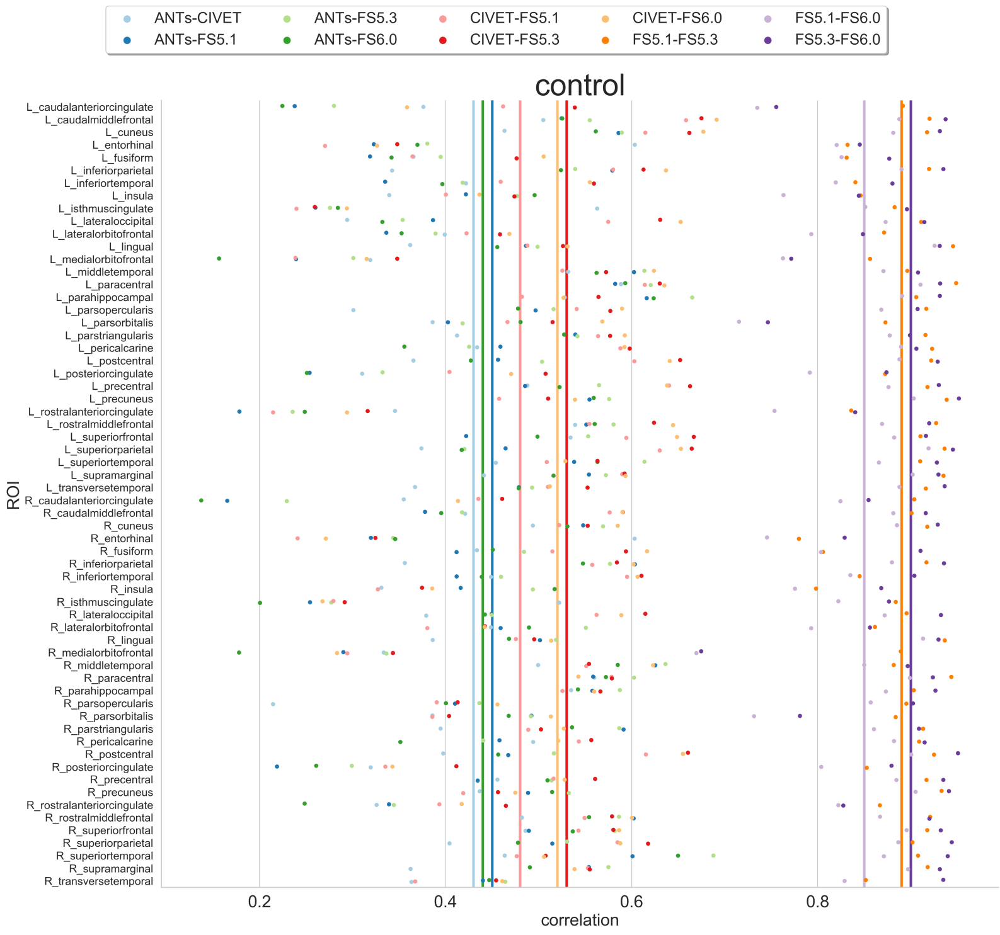

## You Are Here!

## MR image processing pipeline selection choices
- Compute environment 
    - OS
    - math-libs

- Software (algorithms and their versions)
    - image clean-up
    - image preproc
    - image quantification

- Quality control
    - manual
    - automatic

- Biological priors
    - templates
    - atlases

## Example software analysis

- Task: compare cortical thickness between two FreeSurfer and CIVET

_Note: See [this]([https://academic.oup.com/cercor/article/30/9/5014/5831485]) for details on brain plots]_

- Correlation between thickness measurements from FreeSurfer and CIVET pipelines aggregated with DKT parcellation 



