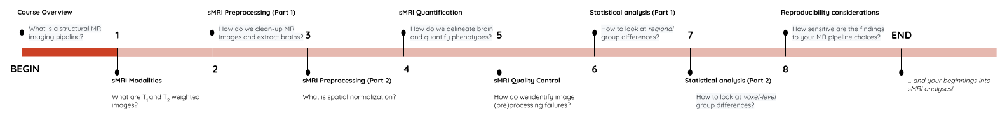

## You Are Here!

Welcome to the **Structural Neuroimaging Analysis in Python** workshop! The primary goals of this workshop are:

1. Understand basics of strcutural MR image acquisition
2. Familiarize with structural MR image (pre)processing pipeline
3. Perform and visualize group-level neuroanatomical analyses

## The Central Objective

This workshop is designed to teach you the basics of handling structural MR images in Python and familiarize you with common image processing tasks in an sMRI processing pipeline part of typical neuroanatomical analyses within case-control studies. 

All of this may sound complicated, but we'll explain things step-by-step in depth with practical examples as the course goes along.

## Topics Covered

1. sMRI Modalities 
2. sMRI Preprocessing (Part 1: image clean-up)
3. sMRI Preprocessing (Part 2: spatial normalization)
4. sMRI Quantification
5. sMRI Quality-Control
6. Statistical Analyses (Part 1: ROIs)
7. Statistical Analyses (Part 2: voxels)
8. Reproducibility Considerations 

In the next section we'll begin with looking at commonly used sMRI modalities in neuroanatomical studies!



