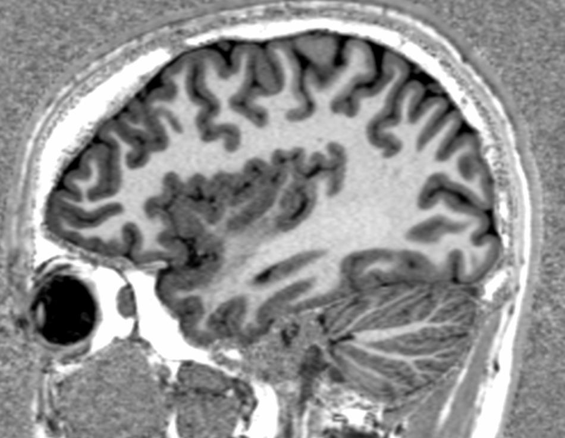

::::::::::::::::::::::::::::::::::::::: objectives

- Visualize and understand differences in T1,T2,PD/FLAIR weighted images.

::::::::::::::::::::::::::::::::::::::::::::::::::

:::::::::::::::::::::::::::::::::::::::: questions

- How is a structural MR image acquired?
- What anatomical features do different modalities capture?

::::::::::::::::::::::::::::::::::::::::::::::::::

## You Are Here!

{alt='course\_flow'}

## Image acquisition

1. The acquisition starts with application of strong magnetic field B<sub>0</sub> (e.g. 1.5 or 3.0 Tesla > 10000x earth's magnetic field) which forces the hydrogen nuclei of the abundant water molecules in soft tissues in the body to align with the field. You can think of hydrogen nuclei as tiny magnets of their own.

2. Then the scanner applies a radio-frequency (RF) (i.e. excitation) pulse which tilts these nuclei from their alignment along B<sub>0</sub>. The nuclei then *precess* back to the alignment. The *precessing* nuclei emit a signal, which is registered by the receiver coils in the scanner.

3. This signal has two components: 1) *Longitudinal* (z-axis along the scanner's magnetic field) and 2) *Transverse* (xy-plane orthogonal to the scanner's magnetic field).

4. Initially the longitudinal signal is weak as most nuclei are tilted away from the z-axis. However this signal grows as nuclei realign. The *time constant* that dictates the speed of re-alignment is denoted by *T1*.

5. Initially the transverse signal is strong as most nuclei are in phase *coherence*. The signal decays as the nuclei dephase as they realign. This decay is denoted by the *T2 time constant*.

6. The tissue specific differences in T1 and T2 relaxation times is what enables us to *see* anatomy from image contrast. The final image contrast depends on when you *listen* to the signal (design parameter: echo time (TE)) and how fast you repeat the *tilt-relax* process i.e. RF pulse frequency (design parameter: repetition time (TR)).

## T1 and T2 relaxation

Here we see signal from two different tissues as the nuclei are tilted and realigned.
The figure on the left shows a single nucleus (i.e. tiny magnet) being tilted away and then precessing back to the the initial alighment along B<sub>0</sub>. The figure on the right shows the corresponding registered T1 and T2 signal profiles for two different "tissues". The difference in their signal intensities results in the image contrast.

{alt='MR\_relax'}

## Brain tissue comparison

The dotted-black line represents the epoch when you "listen" to the signal (i.e. echo time or TE).

{alt='relax\_tissue\_contrast'})

## T1w, T2w, and PD acquisition

|                    | TE short                                                 | TE long (~ T2 of tissue of interest)               | 
| :----------------: | :------------------------------------------------------: | :------------------------------------------------: |
| **TR short (~ T1 of tissue of interest)**                   | T1w                                                      | \-                                                  | 
| **TR long**                   | Proton Density (PD)                                      | T2w                                                | 

*Note*: More recently, the FLAIR (Fluid Attenuated Inversion Recovery) sequence has replaced the PD image. FLAIR images are T2-weighted with the CSF signal suppressed.

:::::::::::::::::::::::::::::::::::::::  challenge

## pulse sequence parameters and image contrast

What are the two basic pulse sequence parameters that impact T1w and T2w image contrasts? Which one is larger?

:::::::::::::::  solution

## Solution

Repetition time (TR) and echo time (TE) are the two pulse sequence parameters that dictate the T1w and T2w image contrasts.
TR > TE.


:::::::::::::::::::::::::

::::::::::::::::::::::::::::::::::::::::::::::::::

### T1 and T2 relaxation times for various tissues

|                    | T1 (ms)                                                  | T2 (ms)                                            | 
| :----------------: | :------------------------------------------------------: | :------------------------------------------------: |
| Bones              | 500                                                      | 50                                                 | 
| CSF                | 4000                                                     | 500                                                | 
| Grey Matter        | 1300                                                     | 110                                                | 
| White Matter       | 800                                                      | 80                                                 | 

:::::::::::::::::::::::::::::::::::::::  challenge

## Tissue type and image contrast

In the T1w image,  which one is brighter: White matter, Grey Matter, or CSF?

:::::::::::::::  solution

## Solution

White Matter (i.e. axonal tracts)


:::::::::::::::::::::::::

::::::::::::::::::::::::::::::::::::::::::::::::::

### T1w, T2w image contrasts

| T1w                | T2w                                                      | 
| :----------------: | :------------------------------------------------------: |
| {alt='T1'}         | {alt='T2'}                                               | 

### Applications per modality

| Modality           | Contrast Characteristics                                 | Use Cases                                          | 
| :----------------: | :------------------------------------------------------: | :------------------------------------------------: |
| T1w                | Cerebrospinal fluid is dark                              | Quantifying anatomy *e.g. measure structural volumes*                               | 
| T2w                | CSF is light, but white matter is darker than with T1    | Identify pathologies related to lesions and tumors | 
| PD                 | CSF is bright. Gray matter is brighter than white matter | Identify demyelination                             | 
| FLAIR              | Similar to T2 with the CSF signal suppressed             | Identify demyelination                             | 

## Image acquisition process and parameters

 

## What do we want?

- High image contrast
- High spatial resolution
- Low scan time!

## What can we control?

### Magnetic strengths 1.5T vs 3T vs 7T

- Higher magnetic strength --> better spatial resolution, better SNR (S ∝ B0^2); but more susceptible to certain artifacts.

### MR sequences (i.e. timings of "excitation pulse", "gradients", and "echo acquisition" )

- Spin echo: Slower but better contrast to noise ratio (CNR)
- Gradient echo: Quicker but more susceptible to noise

e.g. MPRAGE: Magnetization Prepared - RApid Gradient Echo (Commonly used in neuroimaging)

| MP-RAGE            | MP2-RAGE                                                 | 
| :----------------: | :------------------------------------------------------: |
| {alt='mprage'}     |                                                          | 

### Spatial encoding of the signal

- Spatial frequencies (k-space)
- Field of View --> susceptibility to image artifacts (e.g. Aliasing)

{alt='kspace'}

*MPRAGE and k-space images Courtesy of Allen D. Elster, MRIquestions.com*

## Interacting with images (see [this notebook](code/1_sMRI_modalities.ipynb) for detailed example.)

```python
import nibabel as nib
import nilearn
from nilearn import plotting
```

```python
local_data_dir = '../local_data/1_sMRI_modalities/'
T1_filename = local_data_dir + 'craving_sub-SAXSISO01b_T1w.nii.gz'
T2_filename = local_data_dir +'craving_sub-SAXSISO01b_T2w.nii.gz'
T1_img = nib.load(T1_filename)
T2_img = nib.load(T2_filename)

# grab data array
T1_data = T1_img.get_fdata()
T2_data = T2_img.get_fdata()

# plot
plotting.plot_anat(T1_filename, title="T1", vmax=500)
plotting.plot_anat(T2_filename, title="T2", vmax=300)

```

| T1w                | T2w                                                      | 
| :----------------: | :------------------------------------------------------: |
| {alt='nilearn\_T1'} | {alt='nilearn\_T2'}                                       | 


:::::::::::::::::::::::::::::::::::::::: keypoints

- Different acquisition techniques will offer better quantification of specific brain tissues

::::::::::::::::::::::::::::::::::::::::::::::::::


