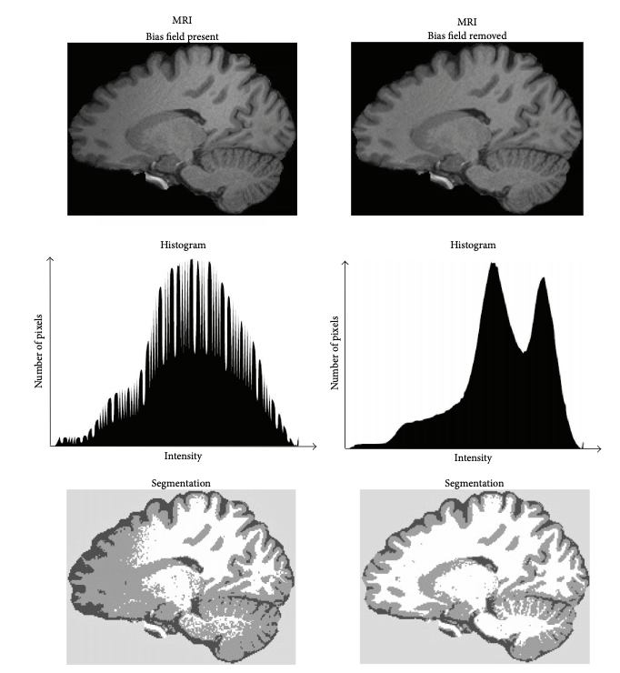
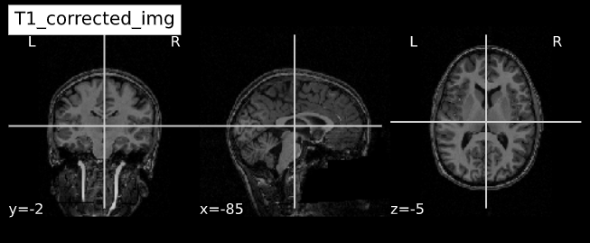
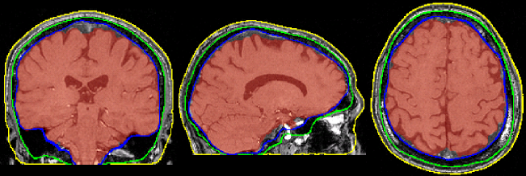
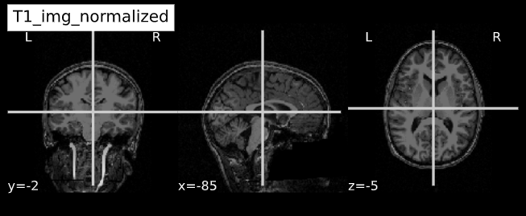
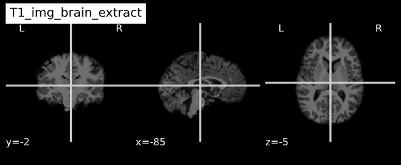

## You Are Here!

## Image Clean-ups
In this episode we will look at two common image clean-up tasks 1) Intensity normalization 2) Brain extraction. Performing these tasks is cruical for the successful processing of subsequent image normalization tasks as well as the downstream statistical analyses. Some version (i.e. custom algorithm) of these two tasks is implemented in all commonly deployed processing pipelines such as FreeSurfer, FSL etc. 

### Intensity normalization (a.k.a bias field correction; a.k.a. intensity inhomogeneity correction)

- The bias field is a low-frequency spatially varying MRI artifact resulting from spatial inhomogeneity of the magnetic field,
variations in the sensitivity of the reception coil, and the interaction between the magnetic field and the human body. 
- It causes a smooth signal intensity variation within tissue of the same physical properties. 
- The bias field is dependent on the strength of the magnetic field. If it is not corrected for 1.5T or higher MR scanners, it can considerably affect downstram analyses. 
- Commonly used tools
    - [ANTs N4 bias correction](https://pubmed.ncbi.nlm.nih.gov/20378467/) (See figure below)
    - [FSL FAST](https://fsl.fmrib.ox.ac.uk/fsl/fslwiki/FAST) (_Note:FSL FAST is a multi-purpose segmentation tool that includes the bias field correction._)

> ## Bias field correction
>
> What is the difference between bias field and image noise?
>
> > ## Solution
> > Bias field is modeled as multiplicative factor, whereas noise is typcally assumed as additive and spatially independent (Gaussian) factor.
> > i.e. v(x) = u(x)f(x) + n(x), where v is the given image, u is the uncorrupted image, f is the bias field, and n is the noise.  
> > 
> {: .solution}
{: .challenge}

### ANTs N4 correction

#### Side-note: [ANTs](http://stnava.github.io/ANTs/) is a software comprising several tools and image processing algorithms. ANTs can be run independently or we can import ANTs scripts in python using [nypype](https://nipype.readthedocs.io/en/latest/) library. 

~~~
from nipype.interfaces.ants import N4BiasFieldCorrection
~~~
{: .language-python}

~~~

n4 = N4BiasFieldCorrection()
n4.inputs.dimension = 3
n4.inputs.input_image = 'structural.nii'
n4.inputs.bspline_fitting_distance = 300
n4.inputs.shrink_factor = 3
n4.inputs.n_iterations = [50,50,30,20]
n4.cmdline 

~~~
{: .language-python}

~~~
'N4BiasFieldCorrection --bspline-fitting [ 300 ] -d 3 --input-image structural.nii --convergence [ 50x50x30x20 ] --output structural_corrected.nii --shrink-factor 3'
~~~
{: .output}

### Impact of correction (_source: [Despotović et al.](https://www.hindawi.com/journals/cmmm/2015/450341/)_)

### Visualizing "before" and "after" see [this notebook](../code/2_sMRI_image_cleanup.ipynb) for detailed example.)
~~~
from nipype.interfaces.ants.segmentation import BrainExtraction
~~~
{: .language-python}
import nibabel as nib
from nilearn import plotting
~~~
T1_orig = subject_dir + 'orig.mgz'
T1_corrected = subject_dir + 'nu.mgz'
T1_img_orig = nib.load(T1_orig)
T1_img_corrected = nib.load(T1_corrected)

# plot
cut_coords = (-85,-2,-5)
plotting.plot_anat(T1_orig, title="T1_orig", cut_coords=cut_coords, vmax=255)
plotting.plot_anat(T1_corrected, title="T1_corrected_img", cut_coords=cut_coords, vmax=255)
~~~
{: .language-python}

|        Before        | After |
| :-------------: | :-----------: |
|  |  |

### Brain extraction (a.k.a skull-stripping)
- Image contrasts from nonbrain tissues such as fat, skull, or neck can cause issues with downstream analyses starting with brain tissue segmentation.
- The brain extraction generates a mask that identifies brain voxels comprising grey-matter (GM), white-matter(WM), and Cerebrospinal fluid (CSF) of
the cerebral cortex and subcortical structures, including the brain stem and cerebellum. 
- The scalp, dura matter, fat, skin, muscles, eyes, and bones are classified as nonbrain voxels.

- Commonly used tools
    - [antsBrainExtraction](https://nipype.readthedocs.io/en/latest/api/generated/nipype.interfaces.ants.html#brainextraction)
    - [FSL brain extraction tool (BET)](https://fsl.fmrib.ox.ac.uk/fsl/fslwiki/BET)

> ## Bias field correction
>
> Apart from stripping off non-brain tissue, what can brain-mask be used for?
>
> > ## Solution
> > Brain mask offers information about total brain volume - which can be used for quality control (i.e. identifying algorithm failures) as well as for brain-specific correction (normalization) for downstream statistical models. Althugh intracranial volume is more commonly used for the latter purpose. 
> > 
> > 
> {: .solution}
{: .challenge}

#### Side-note: [ANTs](http://stnava.github.io/ANTs/) is a software comprising several tools and image processing algorithms. ANTs can be run independently or we can import ANTs scripts in python using [nypype](https://nipype.readthedocs.io/en/latest/) library. 

~~~
from nipype.interfaces.ants.segmentation import BrainExtraction
~~~
{: .language-python}

~~~
brainextraction = BrainExtraction()
brainextraction.inputs.dimension = 3
brainextraction.inputs.anatomical_image ='T1.nii.gz'
brainextraction.inputs.brain_template = 'study_template.nii.gz'
brainextraction.inputs.brain_probability_mask ='ProbabilityMaskOfStudyTemplate.nii.gz'
brainextraction.cmdline
~~~
{: .language-python}

~~~
'antsBrainExtraction.sh -a T1.nii.gz -m ProbabilityMaskOfStudyTemplate.nii.gz
-e study_template.nii.gz -d 3 -s nii.gz -o highres001_'
~~~
{: .output}

#### ANTs Brain Extraction

#### FSL BET 

### Visualizing "before" and "after" see [this notebook](../code/2_sMRI_image_cleanup.ipynb) for detailed example.)
~~~
from nipype.interfaces.ants.segmentation import BrainExtraction
~~~
{: .language-python}
import nibabel as nib
from nilearn import plotting
~~~
T1_normalized = subject_dir + 'T1.mgz'
T1_brain_extract = subject_dir + 'brainmask.mgz'
T1_img_normalized = nib.load(T1_normalized)
T1_img_brain_extract = nib.load(T1_brain_extract)

# plot
cut_coords = (-85,-2,-5)
plotting.plot_anat(T1_img_normalized, title="T1_img_normalized", cut_coords=cut_coords, vmax=255)
plotting.plot_anat(T1_img_brain_extract, title="T1_img_brain_extract", cut_coords=cut_coords, vmax=255)

~~~
{: .language-python}

|        Before        | After |
| :-------------: | :-----------: |
|  |  |



