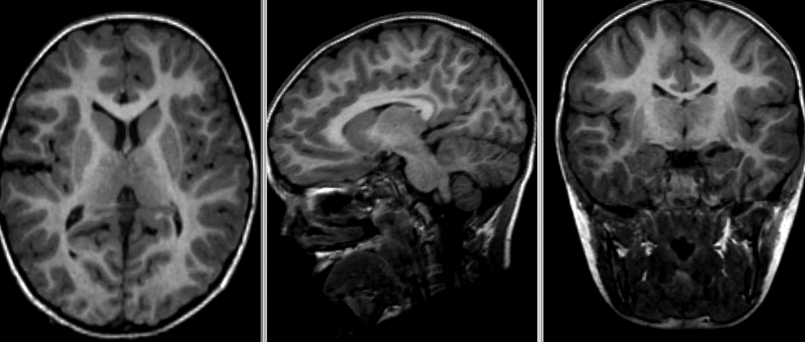

## You Are Here!

## Why do we need spatial normalization
- Compare and combine brain images across subjects and studies

## What do we need for spatial normalization
- A common template: a single or an average image volume as an alignment target 
- A reference frame: A 3D space that assigns x,y,z coordinates to anatomical regions (independent of voxel dimensions!). 
- An atlas: voxel-wise labels associated with a template in a given space

## MR image templates 
- An antomical template is an average MR volume whose voxels encode the average probability of different tissue classes (e.g. WM, GM, and CSF) at particular spatial location. The template creation is an iterative process comprising normalization, alignment, and averaging of a set of MR images from several different subjects. 
- Structural T1‐weighted templates serve as a _common reference space_ and allows researchers to combine and compare data from multiple subjects. 
- Templates play an important role in variety of neuroimaging tasks:
    - Target image for spatial normalization in voxel‐wise analyses
    - Automated internsity based WM, GM, and CSF tissue‐segmentation of MR images 
    - Anatomical atlas creation for region of interest analyses
    - Automated seed selection for connectivity analyses
- A _good_ template is supposed to be _representative_ averages of the study cohort. However for computational reasons (template creation is a computationally intensive process), and to maintain comparability across studies, typically several commonly used templates exist.
- Pulically available commonly used templates
    - [MNI 305](https://ieeexplore.ieee.org/document/373602)
        - an average of 305 T1-weighted MRI scans from young healthy adults
        - 305 normal MRI brains were linearly coregistered (9-param) to 241 brains that had been coregistered (roughly) to the Talairach atlas. 
    - [Collin27](https://journals.lww.com/jcat/Abstract/1998/03000/Enhancement_of_MR_Images_Using_Registration_for.32.aspx)
        - One individual scanned 27 times and the images linearly registered to create an average with high SNR and structure definition 
        - linearly registered to the MNI 305.
        - Used by SPM
    - [MNI152 linear a.k.a. ICBM152](https://www.ncbi.nlm.nih.gov/pmc/articles/PMC1088516/) (International Consortium for Brain Mapping) 
        - an average of 152 T1-weighted MRI scans from young adults
        - linearly coregistered (9-param) to the MNI 305
        - higher resolution and better contrast than the MNI305
        - Used by SPM
    - [MNI152 nonlinear](https://link.springer.com/chapter/10.1007%2F11866763_8)
        - Version of MNI152 nonlinearly registered to MNI 305 
        - Updated versions
            - MNI152NLin6Asym: used by FSL
            - MNI152NLin2009cAsym: used by fMRIprep
    - [MIITRA](https://onlinelibrary.wiley.com/doi/full/10.1002/hbm.25327) 
        - An average of 222 T1-weighted MRI scans from older adults 

    - [fsaverage](https://pubmed.ncbi.nlm.nih.gov/10619420/)
        - _Surface template_ characterized by "vertices and faces/triangles" 
        - spherical alignment of 40 participants 
        - 163,842 vertices per hemispheres

### T1 templates (MNI305, Collin27, MNI152 (linear)m MNI152 (nonlinear))

### Multimodal MNI/ICBM152 atlas

## Stereotaxic space 
- A 3-dimensional coordinate reference frame based on anatomical landmarks - originally used to guide neurosurginal procedures. 
    - A/P means anterior/posterior
    - L/R means left/right
    - S/I means superior/inferior
    - Example: RAS
        - First dimension (X) points towards the right hand side of the head 
        - Second dimension (Y) points towards the Anterior aspect of the head
        - Third dimension (Z) points towards the top of the head 
        - Directions are from the subject's perspective. In the RAS coordinate system, a point to the subject's left will have a negative x value.
- Talairach space
    - Derived from an unrepresentative single 60-yr old female cadaver brain 
    - Ignores left-right hemispheric differences    
- MNI space(s)
    - Similar to the original Talairach space with the Z-coordinate is approximately +3.5 mm offset relative to the Talairach coordinate.

## Image registration
- An process that aligns an image from one coordinate space to another. 
- Used for
    - building templates 
    - native (subject) space to template-space alignment (normalization)
    - inter-subject aligninment (typically for cohort specific)
    - intra-subject aligment (co-registration of image modalities or longitudinal analyses)
- Transfomrations
    - Image similarity metrics: correlation ratio (CR), cross-correlation (CC), mutual information (MI)
    - Linear: global feature aligment
        - Rigid (6 parameters): rotation, translation
        - Affine (12 parameters): rotation, translation, scaling, skewing  
    - Nonlinear (a.k.a elastic): local feature aligment via warping
        - Computationally intensive deformation models with large number of parameters
        - Employ diffeomorphic models that preserve toplogy and source-target symmetry

- Commonly used algorithms

|        Algorithm        | Deformation      | ~ parameters     |
| :-------------: | :----------: | :-----------: |
|  FLIRT | Linear   | 9    |
|  ANIMAL | Non-linear (Local translation)   | 69K    |
|  DARTEL Toolbox |  Non-linear (diffeomorphic)  | 6.4M    |
|  ANTs (SyN)   | Non-linear (bi-directional diffeomorphic) | 28M |

Rigid registration example (_source: [SimpleITK](https://github.com/InsightSoftwareConsortium/SimpleITK-Notebooks)_): 

Nonlinear deformation example _(source: 3D Slicer [publication](https://www.ncbi.nlm.nih.gov/pmc/articles/PMC3466397/), [wiki](https://www.slicer.org/wiki/Documentation:Nightly:Registration:RegistrationLibrary:RegLib_C42))_:


