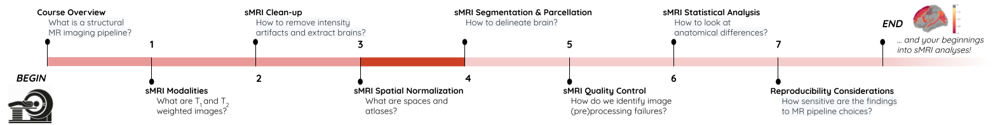
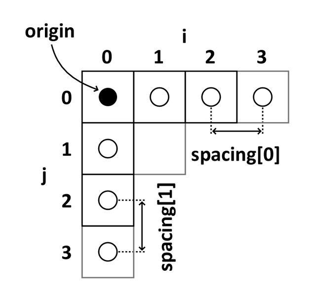
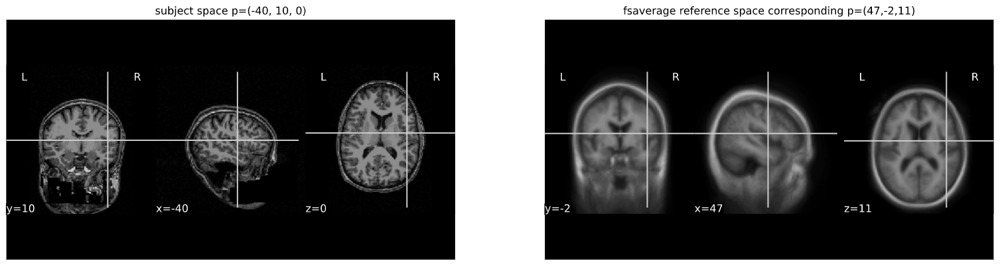

## You Are Here!

## Why do we need spatial normalization
- Compare and combine brain images across modalities, individuals, and studies

## What do we need for spatial normalization
- A reference frame: A 3D space that assigns x,y,z coordinates to anatomical regions (independent of voxel dimensions!). 
- A common template: a single or an average image volume as an alignment target 
- An image registration algorithm

## Coordinate systems and spaces
- World coordinates
- Anatomical coordinates
- Image coordinates 

#### _Image [source](https://www.slicer.org/wiki/Coordinate_systems)_ 

### World coordinates
The world coordinates refer to a Cartesian coordinate system in which a MRI (or other modality) scanner is positioned. 

### Anatomical coordinates
The anatomical space is coordinate system (X,Y,Z) that consists of three planes to describe the standard anatomical position of a human
- *Axial* plane is parallel to the ground and separates the head (Superior) from the feet (Inferior)
- *Coronal* plane is perpendicular to the ground and separates the front from (Anterior) the back (Posterior)
- *Sagittal* plane separates the Left from the Right

The origin and directions of anatomical coordinate system are defined by conventions. In neuroimaging the most commonly used definition is the stereotaxic space. 

#### Stereotaxic space 
- A 3-dimensional coordinate reference frame based on anatomical landmarks - originally used to guide neurosurgical procedures. 
    - A/P means anterior/posterior
    - L/R means left/right
    - S/I means superior/inferior
    - Example: RAS
        - First dimension (X) points towards the right hand side of the head 
        - Second dimension (Y) points towards the Anterior aspect of the head
        - Third dimension (Z) points towards the top of the head 
        - Directions are from the subject's perspective. In the RAS coordinate system, a point to the subject's left will have a negative x value.
- Talairach space
    - Derived from an unrepresentative single 60-yr old female cadaver brain 
    - Ignores left-right hemispheric differences    
- MNI space(s)
    - Similar to the original Talairach space with the Z-coordinate is approximately +3.5 mm offset relative to the Talairach coordinate.

### Image coordinates
The image coordinate system (i,j,k) describes the acquired image (voxels) with respect to the anatomy. The MR images are 3D voxel arrays (i.e. grids) whose origin is assigned at the upper left corner. The i axis increases to the right, the j axis to the bottom and the k axis backwards.

The MR image metadata stores the _anatomical location_ of the image origin and the spacing between two voxels (typically in mm). 

For examples: 
- image coordinate: (0,0,0) ~  anatomical location: (100mm, 50mm, -25mm)
- The spacing between voxels along each axis: (1.5mm, 0.5mm, 0.5mm)

#### _Image [source](https://www.slicer.org/wiki/Coordinate_systems)_ 

> ## Coordinate systems
>
> What happens when you downsample a MR image? 
>
> > ## Solution
> > Downsampling reduces the number of total voxels in the image. Consequently the voxel-spacing is increased as more anatomical space is "sampled" by any given voxel. 
> > Note that the new intensity values of the resampled voxels are determined based on the type of interpolation used. 
> > 
> {: .solution}
{: .challenge}

## MR image templates 
- An antomical template is an average MR volume whose voxels encode the average probability of different tissue classes (e.g. WM, GM, and CSF) at particular spatial location. The template creation is an iterative process comprising normalization, alignment, and averaging of a set of MR images from several different subjects. 
- Structural T1‐weighted templates serve as a _common reference space_ and allows researchers to combine and compare data from multiple subjects. 
- Templates play an important role in variety of neuroimaging tasks:
    - Target image for spatial normalization in voxel‐wise analyses
    - Automated internsity based WM, GM, and CSF tissue‐segmentation of MR images 
    - Anatomical atlas creation for region of interest analyses
    - Automated seed selection for connectivity analyses
- A _good_ template is supposed to be a _representative_ average of the study cohort. However for computational reasons (template creation is a computationally intensive process), and to maintain comparability across studies, image processing pipelines typically use publicly available templates. 
- Commonly used templates:
    - [MNI 305](https://ieeexplore.ieee.org/document/373602)
        - an average of 305 T1-weighted MRI scans from young healthy adults
        - 305 normal MRI brains were linearly coregistered (9-param) to 241 brains that had been coregistered (roughly) to the Talairach atlas. 
    - [Collin27](https://journals.lww.com/jcat/Abstract/1998/03000/Enhancement_of_MR_Images_Using_Registration_for.32.aspx)
        - One individual scanned 27 times and the images linearly registered to create an average with high SNR and structure definition 
        - Linearly registered to the MNI 305
    - [MNI152 linear a.k.a. ICBM152](https://www.ncbi.nlm.nih.gov/pmc/articles/PMC1088516/) (International Consortium for Brain Mapping) 
        - An average of 152 T1-weighted MRI scans from young adults
        - Linearly coregistered (9-param) to the MNI 305
        - Higher resolution and better contrast than the MNI305
        - Used by SPM
    - [MNI152 nonlinear](https://link.springer.com/chapter/10.1007%2F11866763_8)
        - Version of MNI152 nonlinearly registered to MNI 305 
        - Updated versions
            - MNI152NLin6Asym: used by FSL
            - MNI152NLin2009cAsym: used by fMRIprep
    - [MIITRA](https://onlinelibrary.wiley.com/doi/full/10.1002/hbm.25327) 
        - An average of 222 T1-weighted MRI scans from _older adults_
        - Nonlinearly registered to MNI/ICBM152 2009 version.
    - [fsaverage](https://pubmed.ncbi.nlm.nih.gov/10619420/)
        - _Surface template_ characterized by "vertices and faces/triangles" 
        - Spherical alignment of 40 participants 
        - 163,842 vertices per hemispheres

### T1 templates (MNI305, Collin27, MNI152 (linear)m MNI152 (nonlinear))

### Multimodal MNI/ICBM152 atlas

## Image registration
- An process that aligns an image from one coordinate space to another. 
- Used for
    - building templates 
    - native (subject) space to template-space alignment (normalization)
    - inter-subject aligninment (typically for cohort specific)
    - intra-subject aligment (co-registration of image modalities or longitudinal analyses)
- Transfomrations
    - Image similarity metrics: correlation ratio (CR), cross-correlation (CC), mutual information (MI)
    - Linear: global feature aligment
        - Rigid (6 parameters): rotation, translation 
        - Affine (12 parameters): rotation, translation, scaling, skewing  
    - Nonlinear (a.k.a elastic): local feature aligment via warping
        - Computationally intensive deformation models with large number of parameters
        - Employ diffeomorphic models that preserve toplogy and source-target symmetry

_Note: Linear registrations are often used as a initialization step for non-linear registration._ 

- Commonly used algorithms

|        Algorithm        | Deformation      | ~ parameters     |
| :-------------: | :----------: | :-----------: |
|  FSL FLIRT | Linear   | 9    |
|  ANIMAL | Non-linear (Local translation)   | 69K    |
|  DARTEL Toolbox |  Non-linear (diffeomorphic)  | 6.4M    |
|  ANTs (SyN)   | Non-linear (bi-directional diffeomorphic) | 28M |

- Rigid registration example (_source: [SimpleITK](https://github.com/InsightSoftwareConsortium/SimpleITK-Notebooks)_): 
    - The figure below shows the source image being registered to the target (left) in an iterative process. The optimized loss is shown on the right. 

- Nonlinear deformation example _(source: 3D Slicer [publication](https://www.ncbi.nlm.nih.gov/pmc/articles/PMC3466397/), [wiki](https://www.slicer.org/wiki/Documentation:Nightly:Registration:RegistrationLibrary:RegLib_C42))_
    - The figure below shows local deformation (i.e. warping) of source image due to nonlinear registration. 

> ## Image registration quiz
>
> What would the information from non-linear deformation would tell you about the subject? 
>
> > ## Solution
> > The deformation fields encode information regarding local morphometric brain changes. 
> > These can be quantified using "Jacobians" of the deformation field, and can be used to assess subtle morphoetric differences in case-control studies.
> > 
> {: .solution}
{: .challenge}

### Python snippet (see [this notebook](../code/3_sMRI_spatial_norm.ipynb) for detailed example.)
~~~
from nilearn import plotting
from nilearn import image
from nibabel.affines import apply_affine
~~~
{: .language-python}

~~~
cut_coords = (-40,10,0)

A = np.array([[1.053177, -0.061204, -0.060685, 90.310684],
             [0.070210, 1.009246, 0.117766, -9.806847],
             [0.023069, -0.117785, 1.186777, 13.209366],
             [0. ,0. , 0., 1.]])

cut_coords_affine_transformed = apply_affine(A, cut_coords)
x,y,z = cut_coords_affine_transformed
cut_coords_affine_transformed_str = "({},{},{})".format(int(x),int(y),int(z))

print("Subject space to refernce space mapping:\n {} --> {}".format(cut_coords,cut_coords_affine_transformed_str))

~~~
{: .language-python}

~~~
Subject space to refernce space mapping:
 (-40, 10, 0) --> (47,-2,11)
~~~
{: .output}

### Subject space vs refernce space: use cases


