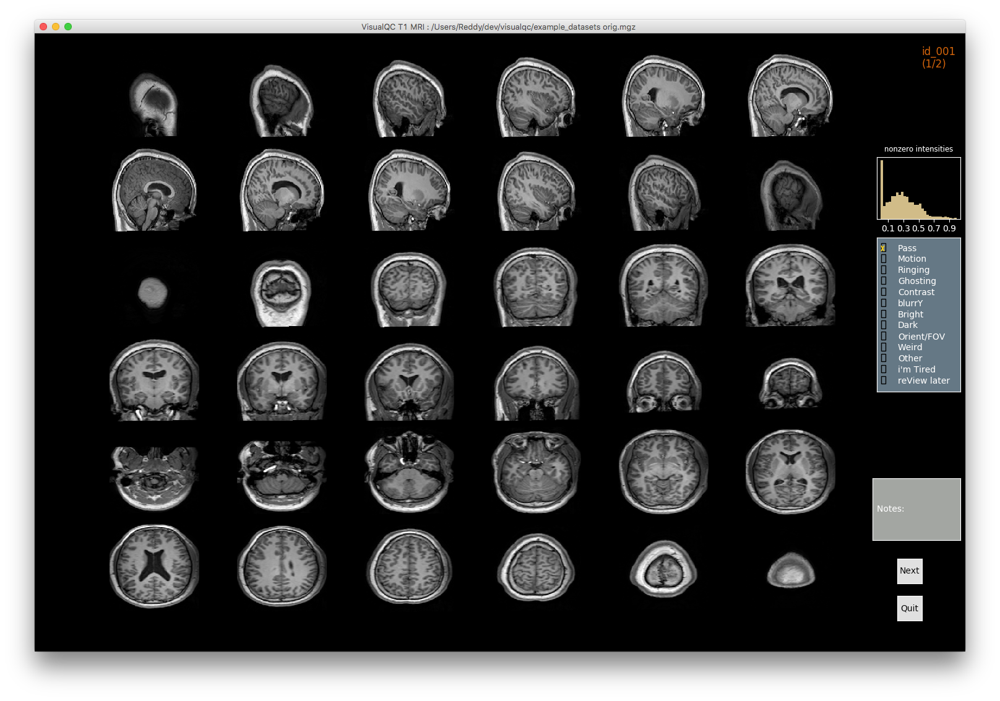
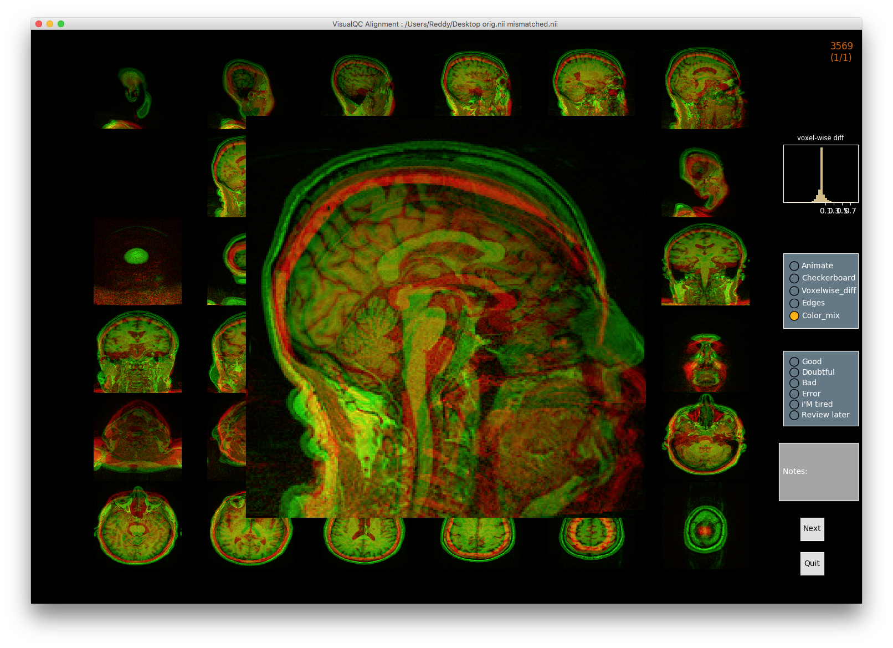

::::::::::::::::::::::::::::::::::::::: objectives

- Visualize processing failures
- Familiarize with automatic QC tools

::::::::::::::::::::::::::::::::::::::::::::::::::

:::::::::::::::::::::::::::::::::::::::: questions

- How do we identify image preprocessing failures?

::::::::::::::::::::::::::::::::::::::::::::::::::

## You Are Here!

{alt='course\_flow'}

## Things that can go wrong...

### Acquistion

#### Due to MR physics (e.g. Field of view (FOV), ghosting, aliasing)

Incorrect parameters can truncate and/or duplicate brain anatomy.

    

#### Due to participant (e.g. Motion artifacts)

- Participant specific issues such as motion artifcats in Parkinson's patients can manifest in the scan (e.g. ringing effect showing ripples or curved lines).

    

### Quantification

Exisiting image processing pipelines (e.g. FreeSurfer, CIVET) will have a few QC tools and examples that can help with failure detection and quality control of volumetric segmentations and surface parcellations.

  

Usage of new method will require your own QC protocols. Especially for highly specific segmentation methods require visual inspection from a neuroanatomy expert. Even for the qualitiative visual inspection, it is important create a QC protocol and share it with the results.

{alt='HC\_and\_CB\_MAGeT'}

*Note: see [Hippocampal](https://dx.doi.org/10.1016/j.neuroimage.2014.04.054) and [cerebellar](https://www.sciencedirect.com/science/article/pii/S1053811914001840?via%3Dihub) for segmentation method details.*

## Automatic QC tools

### Using reports from exisiting pipelines: [https://fmriprep.org/en/stable/\_static/sample\_report.html](https://fmriprep.org/en/stable/_static/sample_report.html)

 

### Using QC tools

#### [MRIQC](https://github.com/poldracklab/mriqc): extracts no-reference IQMs (image quality metrics) from structural (T1w and T2w) and functional MRI (magnetic resonance imaging) data. *(Developed by the Poldrack Lab at Stanford University for use at the Center for Reproducible Neuroscience (CRN), as well as for open-source software distribution.)*

| Individual report        | Group report                                   | 
| :----------------------: | :--------------------------------------------: |
|  |  |

#### [VisualQC](https://github.com/raamana/visualqc): assistive tool to improve the quality control workflow of neuroimaging data (Author: Pradeep Reddy Raamana).

| T1w acquisition          | Alignment                                      | Cortical Parcellation      | 
| :----------------------: | :--------------------------------------------: | :------------------------: |
| {alt='t1\_mri\_visual\_QC'} | {alt='alignment\_mismatched\_colormix\_visualQC'} | {alt='cortical\_zoomed\_in'} | 

:::::::::::::::::::::::::::::::::::::::: keypoints

- Image processing failures happen! It is important to perform systematic quality control to minimize biases

::::::::::::::::::::::::::::::::::::::::::::::::::

