::::::::::::::::::::::::::::::::::::::: objectives

- Understand the main metrics characterizing the brain morphology
- Extract and rely on a set of metrics to assess the effect of age on multiple cortical regions
- Understand and implement voxel based morphometry to investigate the effect of age without predefined regions

::::::::::::::::::::::::::::::::::::::::::::::::::

:::::::::::::::::::::::::::::::::::::::: questions

- How to quantify brain morphology ?
- How to assess statistically differences of brain morphology ?
- Can we detect brain changes related to age in a cohort of young adults ?

::::::::::::::::::::::::::::::::::::::::::::::::::

## You Are Here

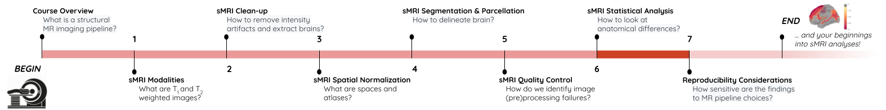{alt='course\_flow'}

All the previous episodes presented the required steps to arrive at a stage where the data is ready for metrics extraction and statistical analysis. In this episode we will introduce common metrics used to characterize the brain structure and morphology, and we will investigate statistical approaches to assess if age related brain changes can be found in a cohort of young adults.

## Quantifying tissue properties

As seen in previous episodes, brain structural data can be represented as volumes or surfaces. Each of these representations are associated to different characteristics. In this episode we will look at:

- how to measure GM volume when looking at volumetric data, i.e. voxels
- how to extract cortical thickness measures derived from surface data, i.e. meshes

### Metric from volumetric data: region volumes

A simple metric to quantify brain imaging data is volume. The image is represented as voxels, however the voxel dimensions can vary from one MRI sequence to another. Some FLAIR sequences have 1.5 mm isotropic voxels (i.e. 1.5 mm wide in all directions), while T1 sequences have 1 mm isotropic voxels. Other sequences do not have isotropic voxels (the voxel dimensions vary depending on direction). As a result the number of voxels is not useful to compare subjects and a standard unit such that mm3 or cm3 should be used instead.

We will consider here a volumetric atlas created by `smriprep/fmriprep` via `Freesurfer`. A particularity is that this atlas is mapped to the subject native space so that we can measure the volume of each atlas ROI in the space of the subject. Our aim is to measure the volume of the right caudate nucleus, in standard unit (mm3). We will first see how to obtain the volume manually, and then how to simply retrieve it from a file referencing several region volumes.

#### Measuring an ROI volume manually

Consider a subject's native T1 volume `t1` and a parcellation of the subcortical GM provided by Freesurfer in that space, `t1_aseg`. We already know from episode 4 how to extract an ROI. According to the [Freesurfer Look-up Table](https://surfer.nmr.mgh.harvard.edu/fswiki/FsTutorial/AnatomicalROI/FreeSurferColorLUT) the right caudate has index 50.

```python
roi_ix = 50
roi_mask_arr_bool = (t1_aseg_data == roi_ix)
roi_mask_arr = roi_mask_arr_bool.astype(int)
roi_mask = nib.Nifti1Image(roi_mask_arr, affine=t1_aseg.affine)
```

We can verify our ROI extraction by plotting it over the subject's T1 data with `nilearn` `plotting` function:

```python
plotting.plot_roi(roi_img=roi_mask, bg_img=t1, alpha=0.4, title='Right Caudate');
```

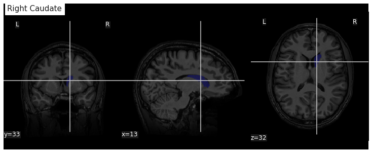{alt='Caudate nucleus from Freesurfer segmentation'}

We can get the number of voxels by counting them in the mask.

```python
caudate_R_n_vox = roi_mask_arr.sum()
caudate_R_n_vox
```

```output
3854
```

An image voxel size can be obtained from the file metadata (i.e. data annotation) stored in the image header. `nibabel` provide an `header` attribute with a method `get_zooms()` to obtain the voxel size.

```python
voxel_dimensions = t1.header.get_zooms()
voxel_dimensions
```

```output
(1.0, 1.0, 1.0)
```

In our case the volume of the voxel, the product of its dimensions, is simply 1mm3:

```python
vox_size = np.array(voxel_dimensions).prod()
vox_size
```

```output
1.0
```

The volume in mm3 of the right caudate of our subject is then:

```python
caudate_R_vol_mm3 = caudate_R_n_vox * vox_size
caudate_R_vol_mm3
```

```output
3854.0
```

Note that `nibabel` offers a utility function to compute the volume of a mask in mm3 according to the voxel size:

```python
import nibabel.imagestats as imagestats
imagestats.mask_volume(roi_mask)
```

```output
3854.0
```

#### Extracting ROI volume from software generated reports

It turns out that characteristics of a number of ROIs are output by Freesurfer and saved in a text file. For example the volume of subcortical ROIs can be found in the file `stats/aseg.stats`. We use the function `islice` of the Python `itertools` module to extract the first lines of the file:

```python
n_lines = 110
with open(os.path.join(fs_rawstats_dir, "aseg.stats")) as fs_stats_file:
    first_n_lines = list(islice(fs_stats_file, n_lines))
```

```output
['# Title Segmentation Statistics \n',
 '# \n',
 '# generating_program mri_segstats\n',
 '# cvs_version $Id: mri_segstats.c,v 1.121 2016/05/31 17:27:11 greve Exp $\n',
 '# cmdline mri_segstats --seg mri/aseg.mgz --sum stats/aseg.stats --pv mri/norm.mgz --empty --brainmask mri/brainmask.mgz --brain-vol-from-seg --excludeid 0 --excl-ctxgmwm --supratent --subcortgray --in mri/norm.mgz --in-intensity-name norm --in-intensity-units MR --etiv --surf-wm-vol --surf-ctx-vol --totalgray --euler --ctab /opt/freesurfer/ASegStatsLUT.txt --subject sub-0001 \n',
...
 '# ColHeaders  Index SegId NVoxels Volume_mm3 StructName normMean normStdDev normMin normMax normRange  \n',
 '  1   4      3820     4245.9  Left-Lateral-Ventricle            30.4424    13.2599     7.0000    83.0000    76.0000 \n',
...
 ' 23  49      7142     6806.7  Right-Thalamus-Proper             83.4105    10.4588    32.0000   104.0000    72.0000 \n',
 ' 24  50      3858     3804.7  Right-Caudate                     73.2118     7.9099    37.0000    96.0000    59.0000 \n',
 ' 25  51      5649     5586.9  Right-Putamen                     79.4707     7.1056    46.0000   103.0000    57.0000 \n',
...
```

Surprisingly the volume in mm3 is not the same as we found: 3804.7. This is because instead of counting each voxel in the GM mask as 100%, the fraction of estimated GM was taken into account.  The estimation of the so called "partial volume" can be done in several manners. One which will be useful for us later is to use the GM probability map `GM_probmap` as a surrogate of a GM partial volume map. Let's see the ROI volume we obtain in this way:

```python
GM_roi_data = np.where(roi_mask_arr_bool, GM_probmap.get_fdata(), 0)
GM_roi_data.sum() * vox_size
```

```output
3354.5343634674136
```

Like with Freesurfer we observe a reduction of GM, albeit significantly more pronounced.

:::::::::::::::::::::::::::::::::::::::  challenge

## Jupyter notebook challenge

Taking into account partial volume, can you measure the volume of the Left Caudate ? And if you feel adventurous of the Left Lateral ventricle ?

:::::::::::::::  solution

## Hint

Use the Freesurfer LUT to identify the correct ROI index. For the lateral ventricle, make sure you use the appropriate tissue type to correct for partial volume effect.

:::::::::::::::::::::::::

::::::::::::::::::::::::::::::::::::::::::::::::::

### Metric from surface data: cortical thickness

As seen in the previous section, volumetric ROI metrics can be made available by dedicated software. This is also the case for surface metrics which are often more involved than computing the number of voxels. One of the most used surface metric is cortical thickness: the distance separating the GM pial surface from the WM surface directly underneath. We will use the output from Freesurfer to:

- extract cortical thickness information
- plot the associated surface data for one subject
- generate and plot summary group measurements

#### Extracting cortical thickness information

Freesurfer output a number of files including both volume and surface metrics. These files are generated by Freesurfer for each subject and can be found in `derivatives/freesurfer/stats` when using `smriprep/fmriprep`.

```python
os.listdir(fs_rawstats_dir)
```

```output
['lh.BA_exvivo.thresh.stats',
 'rh.aparc.a2009s.stats',
 'rh.aparc.pial.stats',
 'rh.aparc.DKTatlas.stats',
 'lh.curv.stats',
 'lh.w-g.pct.stats',
 'wmparc.stats',
 'lh.aparc.stats',
 'rh.BA_exvivo.thresh.stats',
 'rh.BA_exvivo.stats',
 'rh.w-g.pct.stats',
 'lh.aparc.pial.stats',
 'lh.BA_exvivo.stats',
 'rh.curv.stats',
 'aseg.stats',
 'lh.aparc.DKTatlas.stats',
 'lh.aparc.a2009s.stats',
 'rh.aparc.stats']
```

`aseg` files are related to subcortical regions, as we just saw with `aseg.stats`, while `aparc` files include cortical metrics and are often separated into left (`lh`) and right hemisphere (`rh`). `aparc.stats` is for the Desikan-Killiany atlas while `aparc.a2009s.stats` is for the Destrieux atlas (148 ROIs vs 68 ROIs for Desikan-Killiany).

Looking at the Destrieux ROI measurements in the left hemisphere from `lh.aparc.a2009s.stats` we get:

```python
n_lines = 75
with open(os.path.join(fs_rawstats_dir, "lh.aparc.a2009s.stats")) as fs_stats_file:
    first_n_lines = list(islice(fs_stats_file, n_lines))
```

```output
['# Table of FreeSurfer cortical parcellation anatomical statistics \n',
 '# \n',
 '# CreationTime 2019/03/02-22:05:09-GMT\n',
 '# generating_program mris_anatomical_stats\n',
 '# cvs_version $Id: mris_anatomical_stats.c,v 1.79 2016/03/14 15:15:34 greve Exp $\n',
 '# mrisurf.c-cvs_version $Id: mrisurf.c,v 1.781.2.6 2016/12/27 16:47:14 zkaufman Exp $\n',
 '# cmdline mris_anatomical_stats -th3 -mgz -cortex ../label/lh.cortex.label -f ../stats/lh.aparc.a2009s.stats -b -a ../label/lh.aparc.a2009s.annot -c ../label/aparc.annot.a2009s.ctab sub-0001 lh white \n',
 ...
 '# ColHeaders StructName NumVert SurfArea GrayVol ThickAvg ThickStd MeanCurv GausCurv FoldInd CurvInd\n',
 'G&S_frontomargin                         1116    840   1758  1.925 0.540     0.128     0.025       14     1.0\n',
 'G&S_occipital_inf                        1980   1336   3775  2.517 0.517     0.144     0.028       27     2.1\n',
 'G&S_paracentral                          1784   1108   2952  2.266 0.581     0.105     0.018       17     1.3\n',
 ...
```

You can see a number of metrics, with more information in the skipped header on their units. The one of particular interest to us is the cortical thickness `ThickAvg`. Since the thickness is measured at each vertex of the mesh, both the man and standard deviation can be estimated for each ROI. The values at each vertex is available in the freesurfer native file `lh.thickness`. Let's use it to plot the values on a mesh.

#### Plotting cortical thickness values on a subject mesh

To plot the cortical thickness values on a subject cortical mesh we will use the native Freesurfer file formats (although the GII file output by `smriprep/fmriprep` could also be used as seen in episode 4). Considering we identified for the left hemispher the path to the pial mesh `lh_pial` and the mesh thickness values `lh_thickness` (as well as the sulcus mesh `lh_sulcus` for a better plot rendering), we can obtain mesh lateral and medial views with the following Python code:

```python
# Lateral
plotting.plot_surf(lh_pial, surf_map=lh_thickness, hemi='left', view='lateral', bg_map=lh_sulcus);
# Medial
plotting.plot_surf(lh_pial, surf_map=lh_thickness, hemi='left', view='medial', bg_map=lh_sulcus);
```

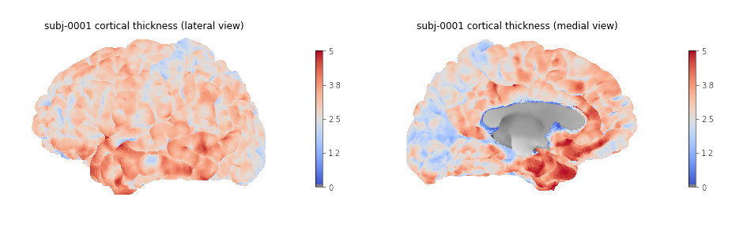{alt='Cortical thickness visualization for a given subject'}

#### Generating and plotting summary group measurements

Files including metrics for each subject can be leveraged to generate group results automatically. The first step is to generate more easily manipulatable CSV/TSV files from the Freesurfer native text files. This can be done with the Freesurfer `asegstats2table` command such as with the code below adapted from [this script](https://github.com/NILAB-UvA/AOMIC-common-scripts/blob/master/fs_stats/create_freesurfer_tables.sh):

```bash
SUBJECTS=(...)
MEASURE=thickness
PARC=aparc.a2009s
for HEMI in lh rh; do
    echo "Running aparcstats2table with measure ${MEASURE} and parcellation ${parc} for hemisphere ${HEMI}"
    aparcstats2table --subjects ${SUBJECTS[@]} \
        --hemi ${hemi} \
        --parc ${parc} \
        --measure ${MEASURE} \
        --tablefile ../derivatives/fs_stats/data-cortical_type-${parc}_measure-${MEASURE}_hemi-${HEMI}.tsv \
        --delimiter 'tab'           
done
```

Then the resulting files can be read with pandas to create a dataframe including cortical thickness information for all our subjects.

```python
hemi="lh"
stats_file = os.path.join(fs_stats_dir, 
                          f"data-cortical_type-aparc.a2009s_measure-thickness_hemi-{hemi}.tsv")
fs_hemi_df = pd.read_csv(stats_file,sep='\t')
fs_hemi_df
```

As shown in the notebook associated with the lesson we can then create a dataframe `fs_df` combining both data from both hemispheres, while also renaming columns to facilitate subsequent analysis.

```python
fs_df
```

```output
participant_id	G_and_S_frontomargin	G_and_S_occipital_inf	G_and_S_paracentral	G_and_S_subcentral	G_and_S_transv_frontopol	G_and_S_cingul_Ant	G_and_S_cingul_Mid_Ant	G_and_S_cingul_Mid_Post	G_cingul_Post_dorsal	...	S_precentral_sup_part	S_suborbital	S_subparietal	S_temporal_inf	S_temporal_sup	S_temporal_transverse	MeanThickness	BrainSegVolNotVent	eTIV	hemi
0	sub-0001	1.925	2.517	2.266	2.636	2.600	2.777	2.606	2.736	2.956	...	2.302	2.417	2.514	2.485	2.462	2.752	2.56319	1235952.0	1.560839e+06	lh
1	sub-0002	2.405	2.340	2.400	2.849	2.724	2.888	2.658	2.493	3.202	...	2.342	3.264	2.619	2.212	2.386	2.772	2.45903	1056970.0	1.115228e+06	lh
2	sub-0003	2.477	2.041	2.255	2.648	2.616	2.855	2.924	2.632	2.984	...	2.276	2.130	2.463	2.519	2.456	2.685	2.53883	945765.0	1.186697e+06	lh
3	sub-0004	2.179	2.137	2.366	2.885	2.736	2.968	2.576	2.593	3.211	...	2.145	2.920	2.790	2.304	2.564	2.771	2.51093	973916.0	9.527770e+05	lh
4	sub-0005	2.483	2.438	2.219	2.832	2.686	3.397	2.985	2.585	3.028	...	2.352	3.598	2.331	2.494	2.665	2.538	2.53830	1089881.0	1.497743e+06	lh
5 rows × 79 columns
```

We can then create a boxplot of the mean cortical thickness distribution in each ROI with `seaborn`, after first converting the dataframe from wide to long format:

```python
plot_df = fs_df[["hemi"] + roi_cols]
## Melt dataframe for easier visualization
plot_long_df = pd.melt(plot_df, id_vars = ['hemi'], value_vars = roi_cols, 
                       var_name ='ROI', value_name ='cortical thickness')
plot_long_df
```

```output
	hemi	ROI	cortical thickness
0	lh	G_and_S_frontomargin	1.925
1	lh	G_and_S_frontomargin	2.405
2	lh	G_and_S_frontomargin	2.477
3	lh	G_and_S_frontomargin	2.179
4	lh	G_and_S_frontomargin	2.483
...	...	...	...
33443	rh	S_temporal_transverse	3.006
33444	rh	S_temporal_transverse	2.683
33445	rh	S_temporal_transverse	2.418
33446	rh	S_temporal_transverse	2.105
33447	rh	S_temporal_transverse	2.524

```

```python
g = sns.catplot(x='cortical thickness', y='ROI', hue='hemi', kind='box', data=plot_long_df)
```

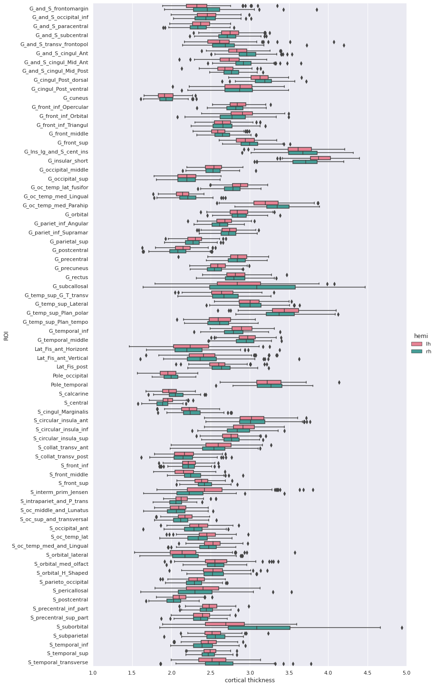{alt='Group cortical thickness boxplot'}

## Statistical analysis: cortical thickness analysis based on a surface atlas

Can we measure cortical thickness changes with age in young adults ?

Now that we have cortical thickness measures, we can try to answer this question by:

- adding subject demographic variables (age, sex) which will serve as predictors
- creating and fitting a statistical model: we will use linear regression model
- plotting the results

### Gathering the model predictors

Since we are interested in the effect of age, we will collect the subject demographics information which is readily available from the BIDS dataset. In addition of the age information, we will use sex as a covariate.

```python
subjects_info_withna = bids_layout.get(suffix="participants", extension=".tsv")[0].get_df()
subjects_info_withna
```

```output
participant_id	age	sex	BMI	handedness	education_category	raven_score	NEO_N	NEO_E	NEO_O	NEO_A	NEO_C
0	sub-0001	25.50	M	21.0	right	academic	33.0	23	40	52	47	32
1	sub-0002	23.25	F	22.0	right	academic	19.0	22	47	34	53	46
2	sub-0003	25.00	F	23.0	right	applied	29.0	26	42	37	48	48
3	sub-0004	20.00	F	18.0	right	academic	24.0	32	42	36	48	52
4	sub-0005	24.75	M	27.0	right	academic	24.0	32	51	41	51	53
...	...	...	...	...	...	...	...	...	...	...	...	...
221	sub-0222	22.00	F	20.0	right	academic	30.0	41	35	51	48	42
222	sub-0223	20.75	F	23.0	left	applied	26.0	33	41	54	36	41
223	sub-0224	21.75	M	20.0	right	academic	34.0	22	45	47	46	46
224	sub-0225	20.25	F	28.0	right	academic	27.0	48	32	43	42	37
225	sub-0226	20.00	M	20.0	right	applied	19.0	28	40	39	42	29
```

:::::::::::::::::::::::::::::::::::::::  challenge

## Jupyter notebook challenge

As the name of our dataframe implies, there may be an issue with the data. Can you spot it ?

:::::::::::::::  solution

## Hint

You'll need to use your `pandas`\-fu for this exercise.  Check for NA (aka missing) values in your `pandas` dataframe. You can use the `isnull()`, `any()` and `.loc` methods for filtering rows.

:::::::::::::::::::::::::

::::::::::::::::::::::::::::::::::::::::::::::::::

:::::::::::::::::::::::::::::::::::::::  challenge

## Jupyter notebook challenge

If you spotted the issue in the previous challenge, what would you propose to solve it ?

:::::::::::::::  solution

## Hint

Data imputation can be applied to appropriate columns, with the `fillna()` method. You may be interested in the `.mean()` and/our `mode()` methods to get the mean and most frequent values.

:::::::::::::::::::::::::

::::::::::::::::::::::::::::::::::::::::::::::::::

Now that we have our predictors, to make subsequent analyses easier we can merge them with our response/predicted cortical thickness variable in a single dataframe.

```python
demo_cols = ["participant_id", "age", "sex"]
fs_all_df = pd.merge(subjects_info[demo_cols], fs_df, on='participant_id')
fs_all_df
```

```output
	participant_id	age	sex	G_and_S_frontomargin	G_and_S_occipital_inf	G_and_S_paracentral	G_and_S_subcentral	G_and_S_transv_frontopol	G_and_S_cingul_Ant	G_and_S_cingul_Mid_Ant	...	S_precentral_sup_part	S_suborbital	S_subparietal	S_temporal_inf	S_temporal_sup	S_temporal_transverse	MeanThickness	BrainSegVolNotVent	eTIV	hemi
0	sub-0001	25.50	M	1.925	2.517	2.266	2.636	2.600	2.777	2.606	...	2.302	2.417	2.514	2.485	2.462	2.752	2.56319	1235952.0	1.560839e+06	lh
1	sub-0001	25.50	M	2.216	2.408	2.381	2.698	2.530	2.947	2.896	...	2.324	2.273	2.588	2.548	2.465	2.675	2.51412	1235952.0	1.560839e+06	rh
2	sub-0002	23.25	F	2.405	2.340	2.400	2.849	2.724	2.888	2.658	...	2.342	3.264	2.619	2.212	2.386	2.772	2.45903	1056970.0	1.115228e+06	lh
3	sub-0002	23.25	F	2.682	2.454	2.511	2.725	2.874	3.202	3.012	...	2.429	2.664	2.676	2.220	2.291	2.714	2.48075	1056970.0	1.115228e+06	rh
4	sub-0003	25.00	F	2.477	2.041	2.255	2.648	2.616	2.855	2.924	...	2.276	2.130	2.463	2.519	2.456	2.685	2.53883	945765.0	1.186697e+06	lh
...	...	...	...	...	...	...	...	...	...	...	...	...	...	...	...	...	...	...	...	...	...
447	sub-0224	21.75	M	2.076	2.653	2.098	2.307	2.463	2.735	2.602	...	2.136	3.253	2.495	2.309	2.562	2.418	2.41761	1140289.0	1.302062e+06	rh
448	sub-0225	20.25	F	2.513	2.495	2.141	2.492	2.757	2.553	2.238	...	2.304	2.870	2.275	2.481	2.533	2.009	2.43156	1080245.0	1.395822e+06	lh
449	sub-0225	20.25	F	3.061	2.164	2.097	2.462	2.753	3.134	2.786	...	2.174	3.429	2.385	2.378	2.303	2.105	2.41200	1080245.0	1.395822e+06	rh
450	sub-0226	20.00	M	3.010	2.189	2.562	3.142	4.072	3.051	2.292	...	2.375	2.812	2.756	2.524	2.617	2.495	2.62877	1257771.0	1.583713e+06	lh
451	sub-0226	20.00	M	3.851	2.270	2.274	2.610	4.198	3.421	3.007	...	2.371	4.938	2.894	2.663	2.445	2.524	2.63557	1257771.0	1.583713e+06	rh
452 rows × 81 columns
```

We can plot the cortical thickness data as a function of age for a single ROI to have an idea of what we may find when applying our model on all ROIs. Let's look for example at the anterior mid-cingulate cortex (`G_and_S_cingul_Mid_Ant`).

```python
response = 'G_and_S_cingul_Mid_Ant'
predictor = 'age'
g = sns.scatterplot(x=predictor, y=response, hue='hemi', data=plot_df)
```

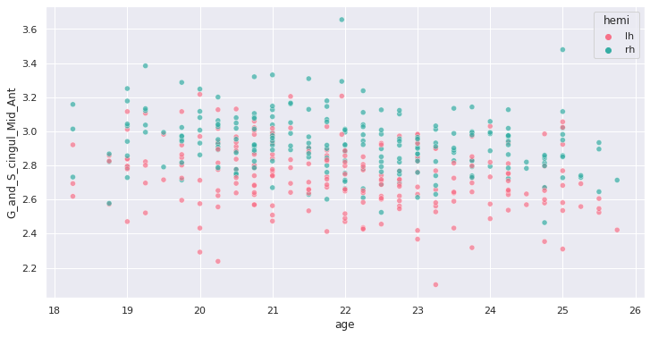{alt='Example of cortical thickness variation with age in an ROI'}

Interesting ! Let's investigate more formally a potential association of cortical thickness with age in young adults.

### Creating and fitting a statistical model

We will implement an ordinary least square (OLS) regression model. Before applying to all ROIs and correcting for multiple comparison, let's test it on our previous ROI example.

For this purpose we use the Python `statsmodels` package. We can create a model formula `{response} ~ {predictor} + {covariates}` (similar to R) and passing it as an argument to the `ols` method before fitting our model. In addition of sex, we will use the total intra-cranial volume (TIV) as covariate.

```python
import statsmodels.api as sm
import statsmodels.formula.api as smf

response = 'G_and_S_cingul_Mid_Ant'
predictor = 'age'
hemi = 'lh'
hemi_df = fs_all_df[fs_all_df['hemi']==hemi]
covariates = 'eTIV + C(sex)'
# Fit regression model
results = smf.ols(f"{response} ~ {predictor} + {covariates}", data=hemi_df).fit()
```

we can now look at the results to check for variance explained and statistical significance.

```python
results.summary()
```

```output
OLS Regression Results
Dep. Variable:	G_and_S_cingul_Mid_Ant	R-squared:	0.060
Model:	OLS	Adj. R-squared:	0.047
Method:	Least Squares	F-statistic:	4.728
Date:	Thu, 03 Jun 2021	Prob (F-statistic):	0.00322
Time:	02:41:24	Log-Likelihood:	62.682
No. Observations:	226	AIC:	-117.4
Df Residuals:	222	BIC:	-103.7
Df Model:	3		
Covariance Type:	nonrobust		
              coef	    std err	     t	    P>|t|	    [0.025	0.975]
Intercept     3.2906	     0.183	     17.954	  0.000	    2.929	    3.652
C(sex)[T.M]  -0.0097	   0.033	    -0.296	  0.768	   -0.074	    0.055
age          -0.0258	   0.007	    -3.706	  0.000	   -0.040	   -0.012
eTIV          1.612e-08	 7.58e-08	 0.213	    0.832	   -1.33e-07	1.66e-07
Omnibus:	2.038	Durbin-Watson:	2.123
Prob(Omnibus):	0.361	Jarque-Bera (JB):	1.683
Skew:	-0.157	Prob(JB):	0.431
Kurtosis:	3.282	Cond. No.	2.03e+07
```

:::::::::::::::::::::::::::::::::::::::  challenge

## Rapid statistical interpretation

Can you provide one sentence summarizing the results of the OLS model regarding cortical thickness and age ?

::::::::::::::::::::::::::::::::::::::::::::::::::

To apply the model to all the ROIs, we use the same code as before but within a for loop. Note that a custom function `format_ols_results` has been created to save the results from the previous output in a dataframe.

```python
# OLS result df
ols_df = pd.DataFrame()
predictor = 'age'
covariates = 'eTIV + C(sex)'
for hemi in ['lh','rh']:
    hemi_df = fs_all_df[fs_all_df['hemi']==hemi]
    for response in roi_cols:
        res = smf.ols(f"{response} ~ {predictor} + {covariates}", data=hemi_df).fit()
        res_df = format_ols_results(res)
        res_df['response'] = response
        res_df['hemi'] = hemi
        ols_df = ols_df.append(res_df)
ols_df
```

```output
          index          coef       std err       t  P>|t|        [0.025        0.975]        R2  \
0     Intercept  2.481300e+00  2.210000e-01  11.239  0.000  2.046000e+00  2.916000e+00  0.004184   
1   C(sex)[T.M] -7.200000e-03  3.900000e-02  -0.182  0.856 -8.500000e-02  7.100000e-02  0.004184   
2           age -7.700000e-03  8.000000e-03  -0.921  0.358 -2.400000e-02  9.000000e-03  0.004184   
3          eTIV  1.781000e-08  9.140000e-08   0.195  0.846 -1.620000e-07  1.980000e-07  0.004184   
0     Intercept  2.593400e+00  1.650000e-01  15.732  0.000  2.269000e+00  2.918000e+00  0.018302   
..          ...           ...           ...     ...    ...           ...           ...       ...   
3          eTIV  4.495000e-08  4.820000e-08   0.933  0.352 -5.000000e-08  1.400000e-07  0.075192   
0     Intercept  3.044100e+00  2.870000e-01  10.589  0.000  2.478000e+00  3.611000e+00  0.040983   
1   C(sex)[T.M] -8.830000e-02  5.100000e-02  -1.718  0.087 -1.900000e-01  1.300000e-02  0.040983   
2           age -2.590000e-02  1.100000e-02  -2.370  0.019 -4.700000e-02 -4.000000e-03  0.040983   
3          eTIV  1.439000e-07  1.190000e-07   1.210  0.228 -9.050000e-08  3.780000e-07  0.040983  
```

We correct the results for multiple comparison with Bonferonni correction before plotting.

```python
predictors = ['age']
all_rois_df = ols_df[ols_df['index'].isin(predictors)]
# Multiple comparison correction
n_comparisons = 2 * len(roi_cols) # 2 hemispheres
alpha = 0.05
alpha_corr = 0.05 / n_comparisons
# Get significant ROIs and hemis
sign_rois = all_rois_df[all_rois_df['P>|t|'] < alpha_corr]['response'].values
sign_hemis = all_rois_df[all_rois_df['P>|t|'] < alpha_corr]['hemi'].values
# Printing correction properties and results
print(f"Bonferroni correction with {n_comparisons} multiple comparisons")
print(f'Using corrected alpha threshold of {alpha_corr:5.4f}')
print("Significant ROIs:")
print(list(zip(sign_rois, sign_hemis)))
```

```output
Bonferroni correction with 148 multiple comparisons
Using corrected alpha threshold of 0.0003
Significant ROIs:
[('G_and_S_cingul_Mid_Ant', 'lh'), ('G_and_S_cingul_Mid_Post', 'lh'), ('G_front_inf_Opercular', 'lh'), ('G_front_middle', 'lh'), ('G_front_sup', 'lh'), ('G_occipital_middle', 'lh'), ('G_temp_sup_G_T_transv', 'lh'), ('S_circular_insula_sup', 'lh'), ('S_front_middle', 'lh'), ('S_front_sup', 'lh'), ('S_parieto_occipital', 'lh'), ('S_precentral_sup_part', 'lh'), ('S_temporal_sup', 'lh'), ('G_and_S_cingul_Mid_Post', 'rh'), ('G_cuneus', 'rh'), ('G_front_inf_Triangul', 'rh'), ('G_front_middle', 'rh'), ('G_front_sup', 'rh'), ('G_pariet_inf_Angular', 'rh'), ('G_precentral', 'rh'), ('G_rectus', 'rh'), ('G_temporal_middle', 'rh'), ('S_circular_insula_sup', 'rh'), ('S_front_sup', 'rh')]
```

We plot the p-values on a log scale, indicating both the non-corrected and corrected alpha level.

```python
g = sns.catplot(x='P>|t|', y='response', kind='bar', hue='index', col='hemi', data=all_rois_df)
g.set(xscale='log', xlim=(1e-5,2))
for ax in g.axes.flat:
    ax.axvline(alpha, ls='--',c='tomato')
    ax.axvline(alpha_corr, ls='--',c='darkred')
```

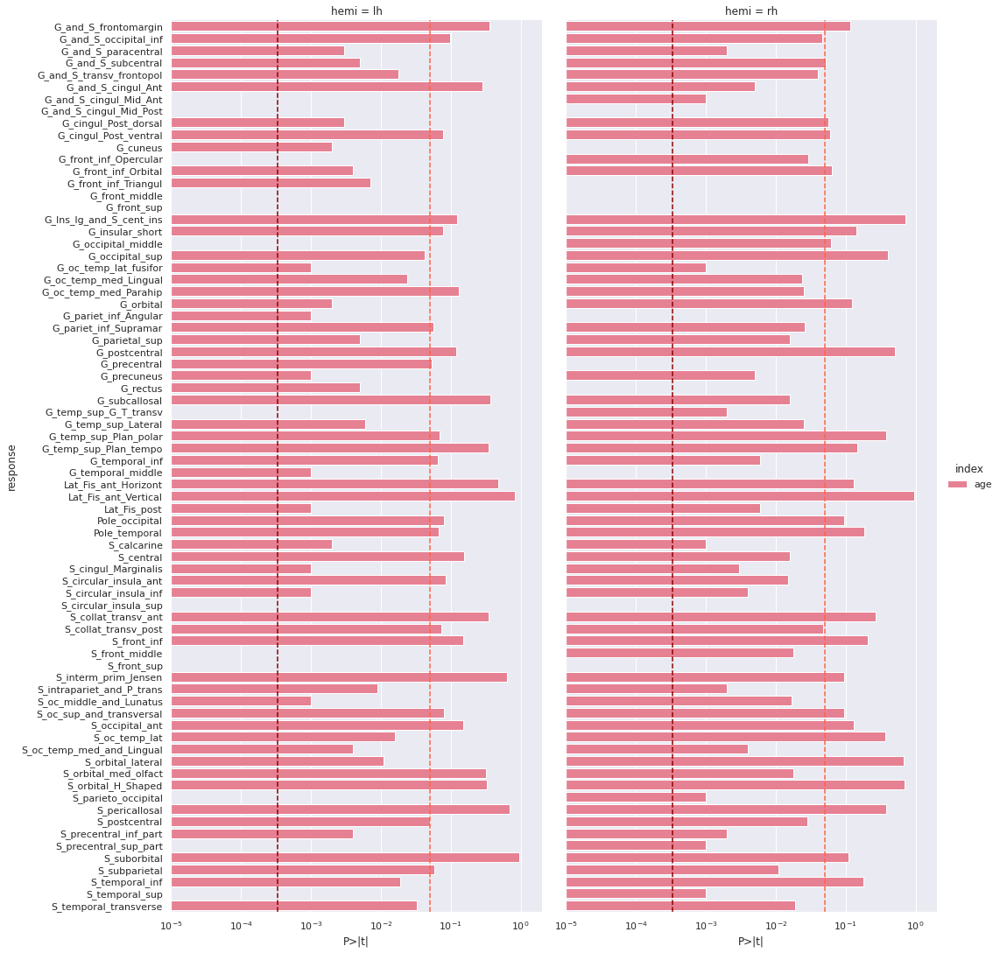{alt='Cortical thickness vs age - p values'}

And the adjusted R-squared

```python
g = sns.catplot(x='R2_adj', y='response', col='hemi', kind='bar', data=all_rois_df)
```

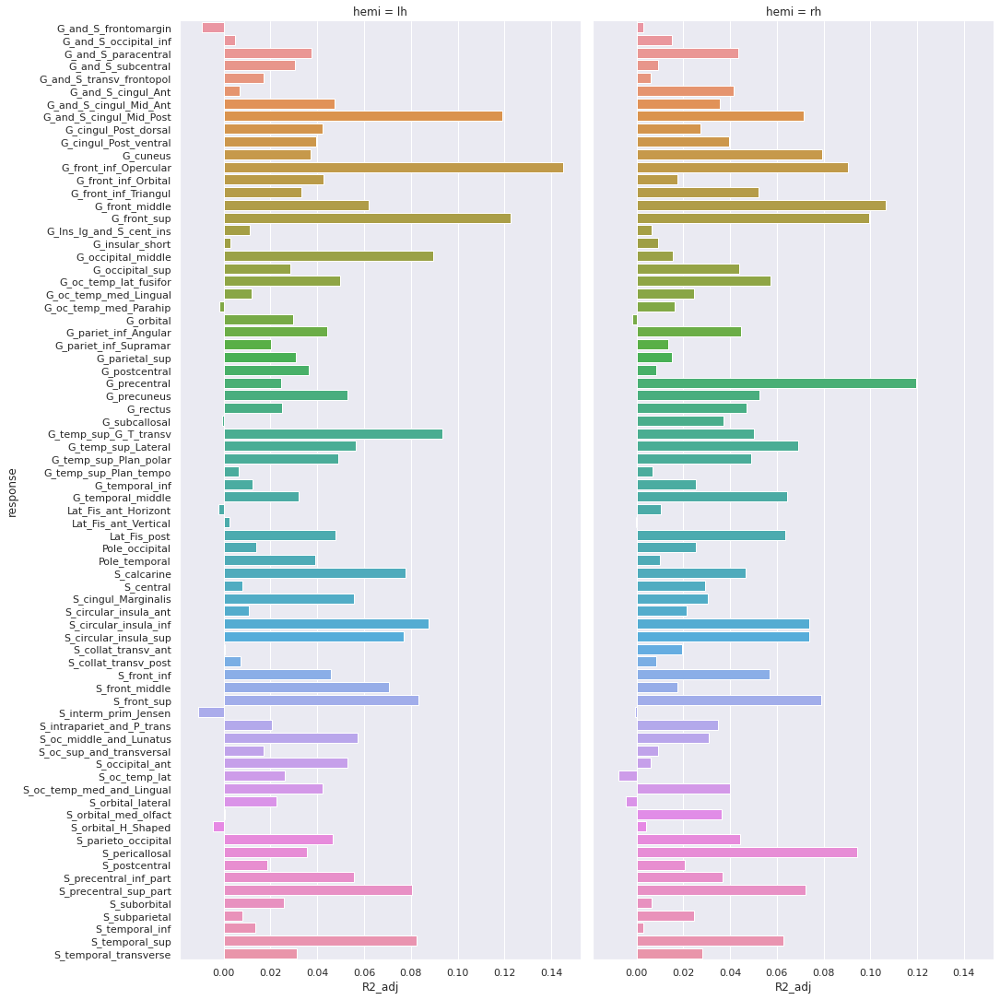{alt='Cortical thickness vs age - adjusted R squared'}

Finally we can plot the t-scores on a mesh for global brain results visualization.

First we import the Destrieux mesh and labels from `nilearn`.

```python
# Retrieve both the Destrieux atlas and labels
destrieux_atlas = datasets.fetch_atlas_surf_destrieux()
parcellation = destrieux_atlas['map_left']
labels = destrieux_atlas['labels']
labels = [l.decode('utf-8') for l in labels]
# Retrieve fsaverage5 surface dataset for the plotting background.
fsaverage = datasets.fetch_surf_fsaverage()
```

Then we a create a statistical map containing one t-score value for each ROI of the mesh. Because the ROI labels are not identical between Freesurfer and `nilearn`, we use a custom function `map_fs_names_to_nilearn` to convert them.

```python
### Assign a t-score to each surface atlas ROI
stat_map_lh = np.zeros(parcellation.shape[0], dtype=int)
nilearn_stats_lh, nilearn_stats_rh = map_fs_names_to_nilearn(all_rois_df, new2old_roinames)
# For left hemisphere
for roi, t_stat in nilearn_stats_lh.items():
    stat_labels = np.where(parcellation == labels.index(roi))[0]
    stat_map_lh[stat_labels] = t_stat
# For right hemisphere
stat_map_rh = np.zeros(parcellation.shape[0], dtype=int)
for roi, t_stat in nilearn_stats_rh.items():
    stat_labels = np.where(parcellation == labels.index(roi))[0]
    stat_map_rh[stat_labels] = t_stat
```

Finally we plot the results with `nilearn` `plot_surf_roi` function.

```python
# Lateral view of left hemisphere
plotting.plot_surf_roi(fsaverage['pial_left'], roi_map=stat_map_lh, hemi='left', view='lateral', 
                       bg_map=fsaverage['sulc_left'], bg_on_data=True);
# Medial view of right hemisphere
plotting.plot_surf_roi(fsaverage['pial_right'], roi_map=stat_map_rh, hemi='right', view='medial',
                       bg_map=fsaverage['sulc_right'], bg_on_data=True);
```

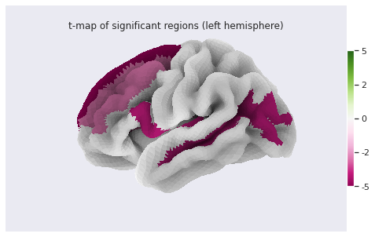{alt='Cortical thickness vs age - surface t values on left hemi'}

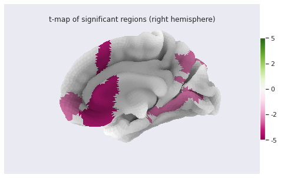{alt='Cortical thickness vs age - surface t values on right hemi'}

## Statistical analysis: local GM changes assessed with Voxel Based Morphometry (VBM)

Relying on an atlas to identify and characterize brain changes or/and group differences is a common practice. While it offers more statistical power by limiting the comparisons to a limited set of regions, it introduces bias (the results depend on the choice of atlases) and may miss out on differences limited to a subregion within ROI. Voxel Based Morphometry (VBM) is a technique purely data-driven to detect changes at voxel level.

VBM aims at investigating each voxel independently across a group of subjects. This is a so called mass-univariate analysis: the analysis is done voxel by voxel and then multiple comparison correction is applied. In order to compare a given voxel across subjects, an assumption is that the voxel is at the same position in the subjects' brain. This assumption is met by registering all maps of interest to a template. The maps investigated are often GM probability maps interpreted as local GM volume (as in this episode).

The comparaison requires first a correction for the transformation to the template space (called modulation), and then a mass-univariate statistical approach. We will examine the VBM workflow step by step. We will run the steps on a limited subset of 10 sujects from our 226 subjects cohort in a `subset` directory, while loading the corresponding cohort pre-computed results in the `all_subjects` directory.

### VBM processing

#### Template creation

:::::::::::::::::::::::::::::::::::::::  challenge

## How to create a template ?

We want to create a template on which to align the GM probability maps of all our subjects. Do you have an idea on how to create this templa?

:::::::::::::::  solution

## Hint

You can have a look at the outputs generated by `smriprep/fmriprep`.

:::::::::::::::::::::::::

::::::::::::::::::::::::::::::::::::::::::::::::::

One answer to the template challenge is to use the probability maps `GM10_probamp_files` created in MNI space by `smriprep/fmriprep` with the `MNI152NLin2009cAsym` template. A simple template can be obtained by averaging all these maps. Note that it is common to create a symmetric by template by average two mirror versions. We are not doing this in this episode.

```python
# Define subset and cohort dirs
vbm_subset_dir = os.path.join(vbm_dir, "subset")
vbm_cohort_dir = os.path.join(vbm_dir, "all_subjects")
from nilearn.image import concat_imgs, mean_img
# For demonstration create template for subset
GM10_probmaps_4D_img = concat_imgs(GM10_probmap_files)
GM10_probmap_mean_img = mean_img(GM10_probmaps_4D_img)
GM10_probmap_mean_img.to_filename(os.path.join(vbm_dir, "GM10.nii.gz"))
# For the real application load corresponding template for the cohort
GM226_probmap_mean_img = nib.load(os.path.join(vbm_cohort_dir, "GM226.nii.gz"))
```

We will need to register all our subject native probability GM map to the template. The resulting template is 1mm-resolution but computation performance is increased if the template has a lower resolution, and our statistical analysis will require smoothing the data in any case. As a result we will resample the template to 2mm.

```python
from nilearn.datasets import load_mni152_template
from nilearn.image import resample_to_img
template = load_mni152_template()
# Apply to our subset
GM10_probmap_mean_img_2mm = resample_to_img(GM10_probmap_mean_img, template)
GM10_probmap_mean_img_2mm.to_filename(os.path.join(vbm_dir, "GM10_2mm.nii.gz"))
# Load for the whole cohort
GM226_probmap_mean_img_2mm = nib.load(os.path.join(vbm_cohort_dir, "GM226_2mm.nii.gz"))
```

We can plot the results to look at the effect of group size and resolution on the templates.

```python
n_plots,n_cols  = 4, 2
### Plot 1 mm templates
# Subset 10
plt.subplot(n_plots, n_cols, 1)
plt.imshow(GM10_probmap_mean_img.get_fdata()[:, :, 100], origin="lower", vmin=0, vmax=1)
# Cohort 256
plt.subplot(n_plots, n_cols, 2)
plt.imshow(GM226_probmap_mean_img.get_fdata()[:, :, 100], origin="lower", vmin=0, vmax=1)
### Plot 2 mm templates
# Subset 10
plt.subplot(n_plots, n_cols, 3)
plt.imshow(GM10_probmap_mean_img_2mm.get_fdata()[:, :, 47], origin="lower", vmin=0, vmax=1)
# Cohort 256
plt.subplot(n_plots, n_cols, 4)
plt.imshow(GM226_probmap_mean_img_2mm.get_fdata()[:, :, 47], origin="lower", vmin=0, vmax=1)
```

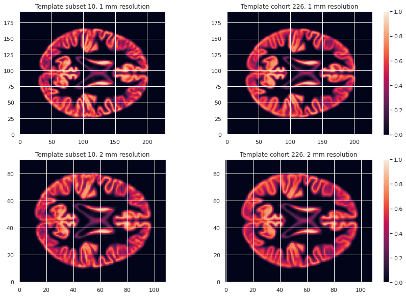{alt='VBM template creation'}

#### Transformation correction, aka modulation

To compare GM values after transformation to the template space, they need to be modulated. Indeed, if a region in the space the subject expands when transformed to the template space, the intensity values must be corrected to account for the actually smaller original volume. This correction can be performed using the ratio between the template local volume and the corresponding original local volume. The amount of transformation is measured in each voxel by the Jacobian determinant J. So the modulation consists in multiplying or dividing by J according to how it is defined by the transformation software(template volume / local volume, or local volume / template volume).

In our case we run the FSL fnirt non-linear transform utility with the code below.

```bash
NATIVE_GM_MAPS=(data/derivatives/fmriprep/sub-*/anat/sub-+([0-9])_label-GM_probseg.nii.gz)
for GM_MAP in ${NATIVE_GM_MAPS[@]}; do 
    SUBJ_NAME=${GM_MAP%%_label*}
    fsl_reg ${GM_MAP} GM226_2mm.nii.gz \
            data/derivatives/vbm/subset/${SUBJ_NAME}/${SUBJ_NAME}_space-GM226_label-GM_probseg \
            -fnirt "--config=GM_2_MNI152GM_2mm.cnf \
            --jout=data/derivatives/vbm/subset/${SUBJ_NAME}/${SUBJ_NAME}_J"
done
```

For FSL the Jacobian determinant output is less than 1 if the original volume expands when warped to the template, and greater than 1 when it contracts.

:::::::::::::::::::::::::::::::::::::::  challenge

## Jupyter notebook challenge

Considering the definition of J output by FSL. In place of the question mark (?), what should be in the code below the mathematical operator applied to the warped GM map to correct for expansion / contraction in the notebook code: +, -, \* or / ?

::::::::::::::::::::::::::::::::::::::::::::::::::

```python
for subj_name in subj_names:
    # Get GM probability map in template space
    warped_GM_file = os.path.join(subj_dir, f"{subj_name}_space-GM226_label-GM_probseg.nii.gz")
    warped_GM = nib.load(warped_GM_file)
    # Get scaling factors (trace of Jacobian)
    J_map_file = os.path.join(subj_dir, f"{subj_name}_J.nii.gz")
    J_map = nib.load(J_map_file)
    # Compute modulated map
    modulated_map = math_img("img1 ? img2", img1=warped_GM, img2=J_map)
    # Save modulated image
    modulated_map_file = os.path.join(subj_dir, f"{subj_name}_space-GM226_label-GM_mod.nii.gz")
    modulated_map.to_filename(modulated_map_file)
```

We can plot all the intermediary steps leading to the modulated maps for two subjects of our cohort.

```python
subs = [1, 2]
n_sub = len(subs)
n_plots, n_cols = 5*n_sub, n_sub
i_slice_match = {1: 50, 2: 52}
for i_sub, sub in enumerate(subs):
    ### Original image
    plt.subplot(n_plots, n_cols, (i_sub+1))
    GM_native_probmap_file = GM_native_probmap_files[sub]
    GM_native_probmap = nib.load(GM_native_probmap_file)
    GM_native_probmap_2mm = resample_to_img(GM_native_probmap, template)
    i_slice = i_slice_match[sub]
    plt.imshow(GM_native_probmap_2mm.get_fdata()[:, :, i_slice], origin="lower", vmin=0, vmax=1.3)
    ### Template
    plt.subplot(n_plots, n_cols, (i_sub+1)+1*n_sub)
    plt.imshow(GM226_probmap_mean_img_2mm.get_fdata()[:, :, 47], origin="lower", vmin=0, vmax=1.3)
    plt.title('Template')
    plt.colorbar();
    # Jacobian
    plt.subplot(n_plots, n_cols, (i_sub+1)+2*n_sub)
    log_ticks = np.logspace(-0.4, 0.4, 10)
    plt.imshow(J_10maps_4D.get_fdata()[:, :, 47, sub], origin="lower", norm=LogNorm())
    # Warped image
    plt.subplot(n_plots, n_cols, (i_sub+1)+3*n_sub)
    plt.imshow(warped_10maps_4D.get_fdata()[:, :, 47, sub], origin="lower", vmin=0, vmax=1.3)
    # Subset 10
    plt.subplot(n_plots, n_cols, (i_sub+1)+4*n_sub)
    plt.imshow(modulated_10maps_4D.get_fdata()[:, :, 47, sub], origin="lower", vmin=0, vmax=1.3)
```

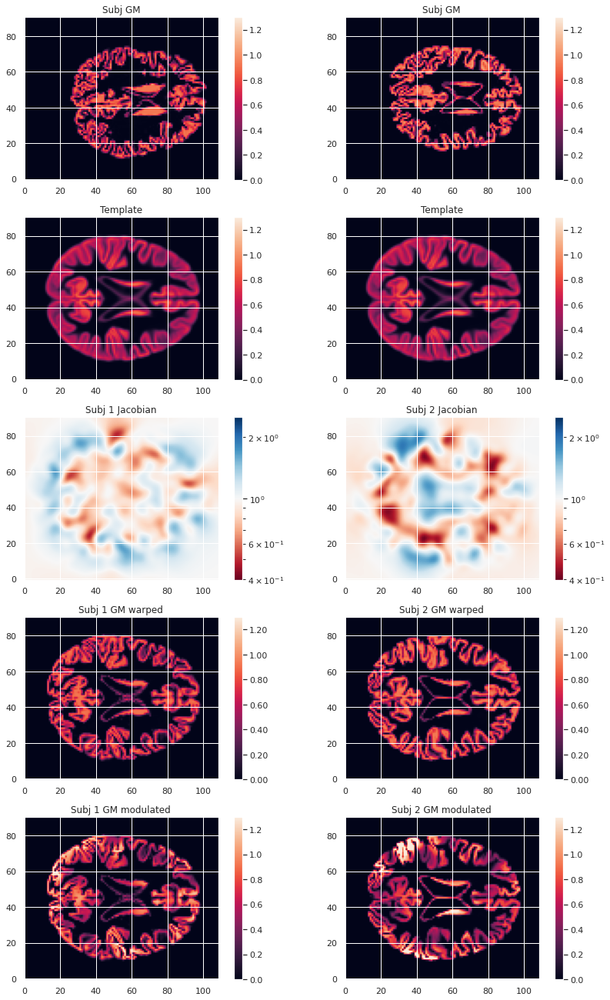{alt='VBM template creation'}

To look at the effect of group size and resolution we can look at the mean warped images for each combination of group size / resolution.

```python
n_plots, n_cols = 6, 2
### Plot GM warped maps
# Subset 10
plt.subplot(n_plots, n_cols, 1)
plt.imshow(warped_10maps_mean.get_fdata()[:, :, 47], origin="lower", vmin=0, vmax=1)
# Cohort 256
plt.subplot(n_plots, n_cols, 2)
plt.imshow(warped_226maps_mean.get_fdata()[:, :, 47], origin="lower", vmin=0, vmax=1)
### Plot Jacobian maps
# Subset 10
plt.subplot(n_plots, n_cols, 3)
plt.imshow(np.log(J_10maps_mean.get_fdata()[:, :, 47]), origin="lower", vmin=-0.5, vmax=0.5)
# Cohort 256
plt.subplot(n_plots, n_cols, 4)
plt.imshow(np.log(J_226maps_mean.get_fdata()[:, :, 47]), origin="lower", vmin=-0.5, vmax=0.5)
### Plot GM modulated maps
# Subset 10
plt.subplot(n_plots, n_cols, 5)
plt.imshow(modulated_10maps_mean.get_fdata()[:, :, 47], origin="lower", vmin=0, vmax=1)
# Cohort 256
plt.subplot(n_plots, n_cols, 6)
plt.imshow(modulated_226maps_mean.get_fdata()[:, :, 47], origin="lower", vmin=0, vmax=1)
```

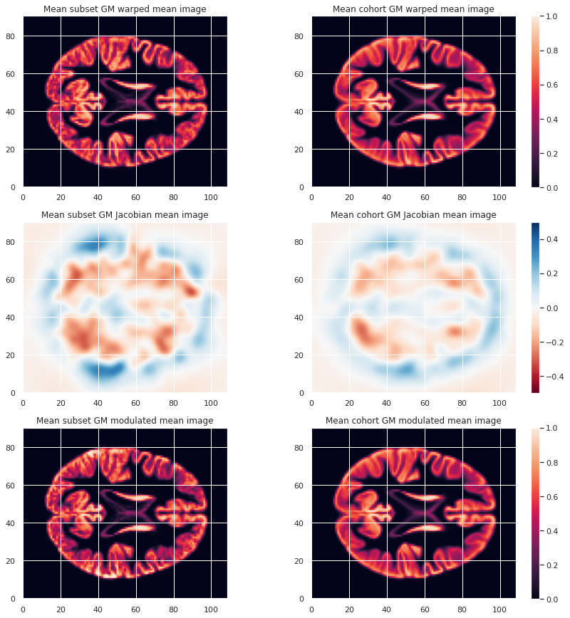{alt='VBM mean warped maps'}

#### Creation of a GM mask

To limit our analysis to GM voxels, a GM mask is useful. We can create it according to the mean modulated GM maps (or e.g. mean GM probabilistic maps), and setting a treshold. In our case we choose a modulation value of at least 0.05 in the group average to be included in the analysis.

```python
GM_mask = math_img('img > 0.05', img=modulated_226maps_mean)
GM_mask.to_filename(os.path.join(vbm_dir, "GM226_mask.nii.gz"))
```

The resulting GM maps cover a large extent of the brain:

```python
plt.imshow(GM_mask.get_fdata()[:, :, 50], origin="lower", vmin=0, vmax=1)
```

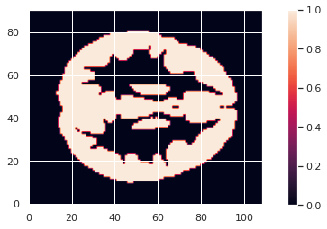{alt='VBM mean warped maps'}

Now that we have the modulated GM maps all aligned, we can carry out the statistical analysis.

### VBM statistical analysis

For the VBM statistical analysis, we implement a two-level GLM model. While it is too long to cover in details in this episode, we can explain it briefly.

#### Principles

Consider a single voxel. The GLM model consists in:

1. At subject level, evaluating the beta parameters (aka regression coefficients) in our model. Our model having:

- Modulated GM as response / predicted variable
- Age and sex as predictors (with sex as a covariate)

2. At group level, indicating what is the combination of model parameters we want to assess for a significant effect. In our case we just want to look at the age beta paramater value across subjects. It is signicantly positive ? Significantly negative ? Not significantly negative or positive ?

#### Design matrix

The first step consists in defining a design matrix, this is a matrix with all our predictors/regressors. In our case this is a column for age, a column for sex, and for an intercept (a constant value).

```python
# For the cohort including all subjects
design_matrix = subjects_info[["participant_id", "age", "sex"]].set_index("participant_id")
design_matrix = pd.get_dummies(design_matrix, columns=["sex"], drop_first=True)
design_matrix["intercept"] = 1
design_matrix
```

```output
                  age  sex_M  intercept
participant_id                         
sub-0001        25.50      1          1
sub-0002        23.25      0          1
sub-0003        25.00      0          1
sub-0004        20.00      0          1
sub-0005        24.75      1          1
...               ...    ...        ...
sub-0222        22.00      0          1
sub-0223        20.75      0          1
sub-0224        21.75      1          1
sub-0225        20.25      0          1
sub-0226        20.00      1          1
```

```python
# For the subset of 10 subjects
dm10 = design_matrix.iloc[:10]
dm10
```

```output
                  age  sex_M  intercept
participant_id                         
sub-0001        25.50      1          1
sub-0002        23.25      0          1
sub-0003        25.00      0          1
sub-0004        20.00      0          1
sub-0005        24.75      1          1
sub-0006        23.75      1          1
sub-0007        19.25      0          1
sub-0008        21.00      1          1
sub-0009        24.75      0          1
sub-0010        24.75      1          1
```

To avoid having noisy data which does not satify the GLM statistical criteria (gaussianity of residuals) it is common to smooth the input maps. A smooth operation is included when implement our model next.

#### Second level GLM

The second step consists in defining what is the linear combination of `[age_beta_parameter, sex_beta_parameter, intercept]` we want to examine. In our case we want to look only at age, so our linear combination is simply `1 * age_parameter + 0 * sex_parameter + 0 * intercept`. This is defined by what is called a contrast, which is then `[1, 0, 0]` in our case.

These two steps can be implemented with the `SecondLevelModel` python object of the `nilearn` `glm` module. We can use the `fit` method of a `SecondLevelModel` object on a design matrix to compute all the beta parameters for each subject. Then we can call the `compute_contrast` method with our contrast to assess if GM local volume is signicantly associated with age.

For our subset of subjects the corresponding Python code is as follows:

```python
from nilearn.glm.second_level import SecondLevelModel

# First level of the two-level GLM
level2_glm10 = SecondLevelModel(smoothing_fwhm=3.0, mask_img=GM_mask)
level2_glm10.fit(modulated_10map_files, design_matrix=dm10)
# Second level of the two-level
contrast = [1, 0, 0]
zmap10 = level2_glm10.compute_contrast(second_level_contrast=contrast, output_type='z_score')
```

For the cohort we can simply load the associated z-score map.

```python
zmap226_file = os.path.join(vbm_dir, "zmap_raw_GM226_age.nii.gz")
zmap226 = nib.load(zmap226_file)
```

from nilearn.glm import threshold\_stats\_img
from nilearn.reporting import make\_glm\_report
from nilearn.plotting import plot\_stat\_map

Finally, do not forget we are looking at a massive collection of voxels.  Because we carry out so many statistical tests (one for each voxel), it is crucial we correct for multiple comparison. We can do so with `nilearn` `threshold_stats_img` function.

For the subset of subjects

```python
zmap10_thr, z10thr = threshold_stats_img(zmap10, mask_img=GM_mask, alpha=.05, 
                                       height_control='fpr', cluster_threshold=50)
```

For the whole cohort

```python
zmap226_file = os.path.join(vbm_dir, "zmap_raw_GM226_age.nii.gz")
zmap226 = nib.load(zmap226_file)
```

We can visualize the results on the cohort either interactively (with an arbitrary cluster threshold for visualization):

```python
zmap226_thr, z226thr = threshold_stats_img(zmap226, mask_img=GM_mask, alpha=.05, 
                                        height_control='fpr', cluster_threshold=50)
```

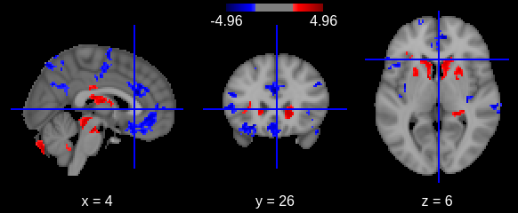{alt='VBM mean warped maps'}

Or with a static plot (no cluster threshold)

```python
plotting.plot_stat_map(zmap226, threshold=zthr, colorbar=True, display_mode='z');
```

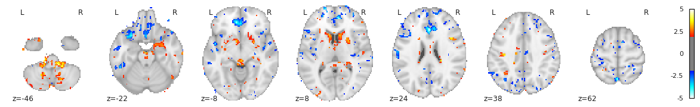{alt='VBM mean warped maps'}

:::::::::::::::::::::::::::::::::::::::: keypoints

- Multiple volumetric and surface metrics exist to characterize brain structure morphology
- Both conventional statistical models and specific neuroimaging approaches can be used
- Caution should be exercised at both data inspection and model interpretation levels

::::::::::::::::::::::::::::::::::::::::::::::::::
