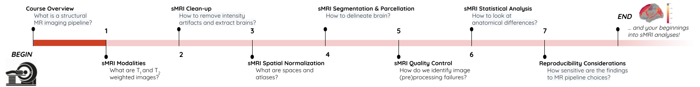

[{alt='Binder'}](https://mybinder.org/v2/gh/carpentries-incubator/SDC-BIDS-sMRI/gh-pages)

Welcome to the **Structural Neuroimaging Analysis in Python** workshop!

The primary goals of this workshop are to:

1. Understand the basics of structural MR image acquisition
2. Familiarize yourself with structural MR image (pre)processing pipelines
3. Perform and visualize group-level neuroanatomical analyses

Things to keep in mind:

1. Magnetic resonance (MR) imaging is a medical imaging technique used to visualize anatomy and the physiological processes of the body. MR imaging scanners use strong magnetic fields, magnetic field gradients, and radio waves to generate images of the organs in the body.

2. In structural neuroimaging, MR scans can refer to several different image modalities including, T1-weighted, T2-weighted, diffusion weighted images (DWI), Proton-Density (PD), Fluid attenuation inversion recovery (FLAIR) etc.

3. An MR (pre)processing pipeline is a set of sequential image processing tasks performed on acquired MR scans prior to the statistical analysis.

4. MR software packages: In order to standardize and simplify computational effort, several software packages encapsulate MR (pre)processing pipelines. Thus as a user, you need not know the details of each image processing algorithm. Nevertheless it is useful to understand the key objectives of these tasks, the corresponding computational approaches, and their impact on the downstream analyses. This will 1) help developers to improve the underlying algorithms and 2) help users to customize the neuroimaging pipelines according to specific dataset requirements. Here are a few common software packages:
  
  - [FreeSurfer](https://surfer.nmr.mgh.harvard.edu/)
  - [FSL](https://fsl.fmrib.ox.ac.uk/fsl/fslwiki)
  - [CIVET](https://www.bic.mni.mcgill.ca/ServicesSoftware/CIVET-2-1-0-Table-of-Contents)
  - [ANTs](https://stnava.github.io/ANTs/)
  - [SPM](https://www.fil.ion.ucl.ac.uk/spm/) (mostly for functional data)
  - [AFNI](https://afni.nimh.nih.gov/) (mostly for functional data)
  - [sMRIprep](https://github.com/nipreps/smriprep) or [fMRIprep](https://github.com/nipreps/fmriprep) (pipeline customization)

*Note: All of this may sound complicated, but we'll explain things step-by-step in depth with practical examples as the course goes along. We will begin our computational journey starting from how an MR image is acquired, followed by several pre-processing tasks, with the end goal of conducting a statistical analysis to investigate neuroanatomical differences between patients and healthy control groups.*

## You Are Here!

{alt='course\_flow'}

::::::::::::::::::::::::::::::::::::::::::  prereq

## Prerequisites

Attendees must have some base familiarity with Python and NIfTI images in order to comfortably progress through the lesson

::::::::::::::::::::::::::::::::::::::::::::::::::

